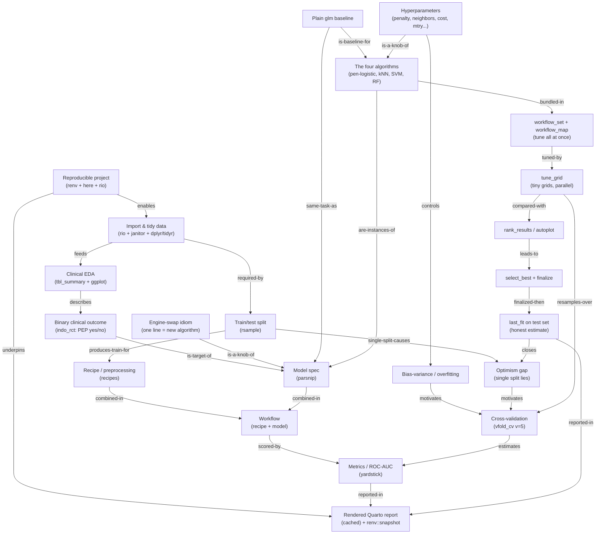
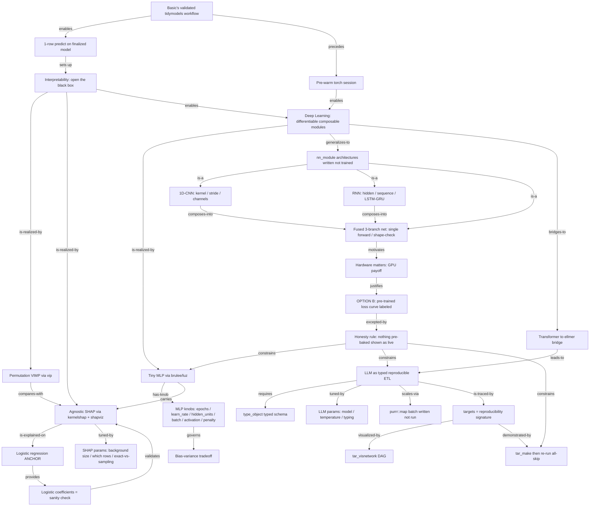

# MLT — Workshop applicativi R (Basic + Advanced) — Design Spec (T3-shaped)

- **Data:** 2026-05-30
- **Repo (hub di pianificazione):** `c:\Users\corra\github\cl\mlt-overview`
- **Autore:** Corrado Lanera (con Claude Code)
- **Stato:** bozza in revisione
- **Metodo:** *Teaching Tech Together* (Greg Wilson) — reverse instructional design
- **Spec collegata:** [`2026-05-26-mlt-course-toolkit-design.md`](2026-05-26-mlt-course-toolkit-design.md) (rinnovazione dell'overview)

> Piano didattico-tecnico dei due workshop applicativi in R che seguono l'overview MLT, progettato con il metodo
> *Teaching Tech Together*: personas → **summative-first** → formative ogni ~15 min → concept graph → sequenza.
> Non è il materiale dei corsi: è la mappa di cosa insegnare, come valutarlo, con quale meccanismo di delivery e
> con quale stile. La costruzione dei due repository avviene **dopo** l'approvazione di questo spec.

---

## 1. Contesto e obiettivo

Scala di **tre corsi** (Scuola di Dottorato in Medicina Specialistica Traslazionale G.B. Morgagni, UniPD), tutti
**1 CFU / duali / in inglese**, nello stesso "mese biostatistico" (maggio). **Durata reale ~4 h lorde (240 min)**
ciascuno (il "10 ore" del syllabus è contabilità CFU).

| Corso | Stato | Ruolo |
|---|---|---|
| **Overview** (Baldi, Lanera) | costruito (`mlt-overview`) | concetti ML — incl. DL, LLM, agenti — **no code** |
| **R — Basic** (Lanera, Vedovelli, Lorenzoni), I sem. | **da costruire** | **costruire e validare** un modello ML clinico, fatto bene |
| **R — Advanced** (Lanera, Vedovelli, Lorenzoni), II sem. | **da costruire** | **interpretarlo e andare oltre** (DL, `ellmer`) |

I syllabus ufficiali sono **guide flessibili, non vincoli** (riscrittura prevista l'anno prossimo). La barra è:
**corso autoconsistente, valido, T3-progettato, che fa un po' di più dove serve agli studenti.**

## 2. Principio: niente carico cognitivo gratuito

**Se uno strumento/tecnica si guadagna tempo a schermo, si guadagna la sua spiegazione — altrimenti si taglia.**
Tagliati in sessione: `skimr`, `tune_bayes`, l'unsupervised hands-on (resta concetto, vedi §6 bridge). Ogni taglio
è un *chunk rimosso dalla working memory*, non solo tempo risparmiato (cfr. load check §10.4 / §11.4).

## 3. Metodo: Teaching Tech Together (reverse design)

Adottiamo il processo a 5 passi di [T3](https://teachtogether.tech/en/index.html):

1. **Learner personas** (§4) — chi insegniamo.
2. **Summative assessment scritto per primo** (§10.1, §11.1) — cosa il discente sa *fare* alla fine: l'ancora.
3. **Formative ogni ~10–15 min** (§10.3, §11.3) — check che fanno emergere i misconcetti dal vivo; le MCQ hanno
   **distrattori diagnostici** (ogni risposta sbagliata rivela un misconcetto specifico da ri-spiegare).
4. **Concept graph** (§10.2, §11.2) — concetti come nodi, relazioni come archi; è anche il **rilevatore di
   sovraccarico** ($7 \pm 2$ chunk per blocco).
5. **Sequenza** — l'agenda timed (§10.3, §11.3).

Allineamenti già nativi nel progetto: live-coding (constraint dell'autore = best-practice T3), formative "Your
turn / My turn" + `{countdown}`, cartelle checkpoint anti-fall-behind, `studente-confuso`/`itembank` come review
T3. L'unico pezzo nuovo è il **concept graph** — ora incluso.

## 4. Learner personas

Audience eterogenea: un nucleo del **curriculum di biostatistica** (per cui il corso è obbligatorio) + clinici di
altri curricula (in aula c'erano cardiologi). Quattro personas guidano ogni decisione:

- **Sara — biostatistica (nucleo obbligatorio).** Conosce R base + regressione + bias-variance; **non** il
  tidyverse/tidymodels. Vuole ML + riproducibilità per la tesi. Mai persa sulla statistica, può perdersi sulla
  *sintassi* tidyverse.
- **Marco — dottorando in cardiologia (altro curriculum).** Forte clinica, legge paper ML; coding minimo (ha
  aperto R una volta), statistica applicata (legge OR/KM). Gli servono rilevanza clinica (`indo_rct`, tabelle
  `gtsummary` che riconosce), pace del live-coding, le cartelle fall-behind. **È il vincolo di carico cognitivo.**
- **Lucia — dottoranda epi/sanità pubblica.** Stata/SPSS, **zero R**. Forte sul disegno, debole sul codice. Le
  serve il primer tidyverse-da-zero, `here`/`rio`, la rete di sicurezza. È **perché il primer non può azzerarsi**.
- **Davide — dottorando data-savvy (da non annoiare).** Un po' di Python/scikit-learn, un po' di R; qui per DL +
  `ellmer` + GPU. Annoiato dai default; tenuto in pista dalle estensioni *stretch* "Your turn", dall'eleganza dei
  `workflowsets`, dal DL spectrum, dalla demo GPU, dal typed-ETL di `ellmer`. Fa le domande difficili.

## 5. Decisioni prese (sessione 2026-05-30)

1. **Framework DL:** **`torch` + `luz` (+ `brulee`)**, *non* `keras3`. `torch` = libtorch nativo **senza Python**
   → installabile in aula duale. `brulee` porta un MLP *dentro* tidymodels; `luz` per reti più libere.
2. **Layout (rivisto 2026-05-30):** **due cartelle nello stesso repo `mlt-overview`** —
   `workshops/mlt-r-basic`, `workshops/mlt-r-advanced` — ognuna **progetto autonomo** (`.Rproj` + `renv` propri,
   nested) con cartelle incrementali. Tutto integrato e versionato in **un posto** (uniformità/visibilità, anche
   date). Per `use_course` basta uno **ZIP per cartella** (un hook genererà `mlt-r-*.zip` in root) → stessa UX
   `usethis::use_course()`, senza repo separati. *Override della precedente "due repository separati"; meccanismo
   ZIP/hook da rifinire dopo.*
3. **Stack ML:** **tidymodels-first**, niente `caret`. **Zoo a 4** (logistic, k-NN, SVM, RF).
4. **Tuning (Basic):** **tutte e quattro le tecniche tunate e spiegate, con slide**, ma via **un solo
   `workflow_set` + `workflow_map('tune_grid')`** su `vfold_cv` condivisa (idiomatico *e* più rapido del tuning
   uno-a-uno → elimina la deviazione "fit-ai-default poi tuning"). Solo `tune_grid` (no Bayes).
5. **Interpretability (Advanced):** VIMP (permutation, `{vip}`) + SHAP agnostico (`{kernelshap}`+`{shapviz}`; override §11),
   **live su ~2 dei 4** (logistic *anchor* + 1 riga RF, background minuscolo), gli altri 2 **descritti**; logistic
   come *sanity anchor* (SHAP deve recuperarne i coefficienti).
6. **DL spectrum (Advanced) — opzione B:** MLP **addestrato live** + SHAP-callback live; CNN/RNN/**rete fusa**
   3-branch→1-output **scritte live** (`nn_module`) con un solo `forward()`/shape-check (no training); **demo
   GPU-vs-CPU** sul workload fuso (epoca CPU che arranca → kill → risultato GPU); **una sola eccezione etichettata**:
   la loss-curve della rete fusa pre-addestrata, annunciata "I trained this earlier on GPU". Transformer → ponte a `ellmer`.
7. **`ellmer` (Advanced):** LLM come **ETL tipizzato e riproducibile** (`type_object()`), **una** estrazione live;
   batch `purrr::map` *scritto non eseguito*. Distinto dal corso LLM (LM Studio) di Vedovelli.
8. **Dataset:** **`medicaldata::indo_rct`** — *verificato*: 602 righe, outcome factor `0_no`/`1_yes`, **event rate
   ~13.1%** (giustifica ROC-AUC > accuracy), predittori `age, risk, gender, sod, rx`(placebo/indomethacin)`, type, site`.
9. **Doctrine di delivery:** live-coding, **nessun risultato pre-cotto mostrato come live** (§8).

## 6. Posizionamento e non-sovrapposizione

**Vs Overview:** i workshop sono il payoff dei pre-hook ([toolkit-design §14.5](2026-05-26-mlt-course-toolkit-design.md)).
L'overview *promette* interpretability a [`index.Rmd:2119-2137`](../../index.Rmd) ("RF difficult to interpret… NN
truly black boxes… Variable importance, SHAP") senza realizzarla → **Advanced la mantiene**. MLP (ch05) e CNN/RNN
(ch06) diventano codice. **Bridge unsupervised:** una frase in Basic (paradigma già in overview ch01, fuori scope).

**Vs corso LLM di Vedovelli** (LM Studio, modelli locali, teoria): l'accento `ellmer` **non ripete** teoria/locale
→ angolo distinto **LLM-as-typed-ETL in R**. Transformer (overview = solo GPT) = slide-ponte verso `ellmer`.

## 7. Meccanismo di delivery condiviso (semplificazione di `ws-reproj`)

**Un progetto autonomo per workshop** (`.Rproj` + `renv`), **cartelle-checkpoint `steps/NN-slug/`** (vs i 6 repo +
submodule di `ws-reproj`). I due progetti vivono come **cartelle in `mlt-overview/workshops/`** (§5.2), distribuite
come ZIP via `use_course`. Ogni cartella = snapshot **completo e cumulativo**; **la soluzione dello step N è lo step N+1**.

```
mlt-r-basic/  (idem advanced)
├── mlt-r-basic.Rproj · renv/ renv.lock .Rprofile · CLAUDE.md · _manifest.yml
├── README.md            # one-liner use_course + Posit Cloud
├── slides/              # Quarto revealjs (build separata) → Pages
└── steps/NN-slug/       # data-raw/ data/ output/ R/ + NN-slug.qmd (driver, params$solved)
```

- **Anti-fall-behind:** una `usethis::use_course("CorradoLanera/mlt-r-basic")` → tutti i checkpoint; resti indietro
  → apri `steps/04-…/`.
- **Your turn / My turn:** `params$solved` rende da un'unica sorgente la versione coi buchi (`___`) e quella
  risolta; "Your turn" (compito + `{countdown}`) → "My turn" (live-solve); presenza = pad / remoto = poll-doc.
- **Distribuzione:** `use_course()` + un Posit Cloud per workshop. Slide = build separata, tema SCSS arancione.

## 8. Doctrine di delivery: live-coding, nessun risultato pre-cotto come live

Vincolo dell'autore, allineato a T3 (*Teaching as a Performance Art*): **si scrive ed esegue tutto dal vivo, niente
copia-incolla, niente risultati pre-cotti mostrati come live.** Riconciliazione con le cartelle precompilate:

- Le cartelle `NN-slug/` precompilate sono la **rete degli studenti** (fall-behind + answer key), **non** ciò che
  il docente mostra a schermo.
- Per i passi compute-heavy: **calcola in piccolo dal vivo** (SHAP su background ~30–50 righe; MLP ~10–30 epoche) e
  **scrivi-ma-non-eseguire** il pesante (architetture CNN/RNN/fusa; batch `ellmer`). Non si mostra mai un numero
  pre-cotto *come se* fosse live.
- **Una sola eccezione, etichettata:** la loss-curve della rete fusa (opzione B, §5.6), annunciata come
  pre-addestrata su GPU — è un *oggetto didattico dichiarato*, non un live finto.
- `{targets}` che ri-mostra un risultato cache-ato come "skip" è **riproducibilità** (ri-derivabile, hash-checked),
  concettualmente diverso dal pre-cotto-finto (cfr. MCQ Advanced min 92).

## 9. Contratto di stile R (verificato su `phd-mlt`, `2023-ecdc-rws`, `ws-reproj`; nel `CLAUDE.md` di ogni repo)

Pipe nativa `|>` (mai `%>%`, placeholder `_`) · `<-` oggetti / `=` argomenti · snake_case con suffisso di tipo
(`db_tbl`, `train_data`) · **tutti i path via `here::here()`** · `library()` + `renv`, mai `install.packages()`
nudo · `{rio}::import()` · ggplot: dati in `|>`, layer con `+`, poi `ggsave()` · multi-arg un per riga, virgola
finale · banner `# Sezione ----` · 2-spazi · `set.seed(123)` · **studenti EN / voce docente IT**.

---

## 10. WORKSHOP **Basic** — backward design

*Costruire e validare un modello ML clinico, fatto bene.* Dataset: `indo_rct`. Arco canonico `fit → tune → validate`.

### 10.1 Summative assessment (scritto per primo — l'ancora)

**Culminating task** (ultima "Your turn" dello step 04, ~12 min, poi chiuso nel report step 05). Sul *proprio*
laptop (o sulla cartella `04-` se rimasto indietro), partendo dal `workflow_set` dei quattro algoritmi già
costruito: (1) tunare i quattro in **una** `workflow_map("tune_grid", resamples = folds, grid = 8, metrics =
metric_set(roc_auc))` sulla **stessa** `vfold_cv(v=5)`; (2) `rank_results()`/`autoplot()` → nominare il vincitore
per CV ROC-AUC; (3) `extract_workflow_set_result()` → `select_best("roc_auc")` → `extract_workflow()` |>
`finalize_workflow()` → **`last_fit()` sul test set intoccato**; (4) riportare **sia** l'AUC CV **sia** l'AUC test, e
dire **una frase** sul perché il numero test è quello onesto e il single-fit era ottimistico; (5) provare
l'**engine-swap**: cambiare *una riga* per sostituire un algoritmo e re-inserirlo nel set. L'artefatto è il **report
Quarto riproducibile** (step 05) che renderizza da cache e chiude con `renv::snapshot()` — *runnable da un terzo*.

**Success criteria** (osservabili): un solo oggetto `folds` riusato per tutti i workflow · nomina il vincitore e
giustifica **ROC-AUC > accuracy** per l'imbalance (~13% eventi: un "predici sempre no" è ~87% accurato ma inutile) ·
`last_fit()` sul test **una sola volta**, riporta l'AUC test come stima onesta · enuncia l'optimism gap in una frase
· dimostra l'engine-swap (una riga) · il report renderizza (cache) e chiude con `renv::snapshot()`, riproducibile da
un peer · legge l'AUC in termini clinici (discriminazione del rischio PEP).

**Persona fit:** i 4 workflow + recipe sono costruiti *insieme* in 03-04 (My-turn) **prima** del task → è
*comporre* blocchi verificati, non scrivere da zero; la cartella `steps/04-…/` salva Marco/Lucia (RUN+READ+
INTERPRET-una-frase, dove la lettura clinica di Marco e l'istinto di disegno di Lucia compensano la sintassi); Sara
passa sulla statistica; **stretch Davide:** 5° engine via swap di una riga nello stesso `workflow_map`, griglia
space-filling in parallelo, e *quando `rank_results` top-by-mean inganna* (CV sovrapposte, regola 1-SE).

### 10.2 Concept graph (validato via Mermaid CLI/MCP — 25 nodi)



### 10.3 Agenda timed + formative ogni ~15 min (break dopo step 03)

| time | step (mode) | objectives (osservabili) | min |
|---|---|---|---|
| 0:00 | **opening** (restore warms) | — | 8 |
| 0:08 | **00 setup** (demo) | aprire `.Rproj`, `renv::restore`, caricare con `here`+`rio` | 10 |
| 0:18 | **01 import+wrangle** (hands-on) | tidyverse primer; pulire/ricodificare con `dplyr`/`tidyr` e `|>`; outcome a factor con positive level | 32 |
| 0:50 | **02 clinical EDA** (hands-on, *elastico*) | `tbl_summary(by=outcome)`; un `ggplot`; leggere imbalance → scelta metrica | 22 |
| 1:12 | **03 logistic spine** (hands-on) | framing supervised (+1 frase unsupervised fuori scope); object-map `rsample→recipes→parsnip→workflows→yardstick`; `glm` baseline + yardstick | 38 |
| 1:50 | **break** | — | 15 |
| 2:05 | **04 the zoo, tuned & validated** (hands-on) | 4 slide-parametro (pen-logistic `penalty/mixture`, kNN `neighbors`, SVM `cost/rbf_sigma`, RF `mtry/min_n`) → `workflow_set` + `workflow_map` tune-all su `vfold_cv` → `rank_results`/compare → `finalize` → `last_fit` | 68 |
| 3:13 | **05 repro-report** (demo) | render Quarto cache-ato + `renv::snapshot`; pre-hook ad Advanced | 13 |
| 3:26 | **closing + buffer** | — | 17 |

**Formative map** (10 check, ~ogni 10–15 min; MCQ con distrattori diagnostici):

| dopo | min | tipo | cosa verifica · (MCQ) distrattori → misconcetto |
|---|---|---|---|
| 00 | 9 | live-check | env sano: `.Rproj` aperto, `renv::status()` in sync, `here::here()` = root. GREEN/RED |
| 01 | 30 | your-turn | `clean_names`→`select`(7 col)→`filter`(NA age)→`glimpse`; stretch Davide: `high_risk` da mediana *su train* (leakage) |
| 01 | 31 | **mcq** | semantica pipe/verbi: ✓ il tibble passa come 1° arg, ritorna copia nuova · distrattori → *in-place/Stata `keep if`*; *NSE non capita*; *pipe inoltra ultimo oggetto non LHS* |
| 02 | 50 | **mcq** | perché ROC-AUC>accuracy: ✓ 13% eventi, "predici no"=87% ma inutile · distrattori → *AUC=metrica cosmetica*; *imbalance rende accuracy indefinita*; *over-generalizza "accuracy invalida per ogni split disuguale"* |
| 03 | 72 | your-turn | `glm` vs workflow danno stessa AUC ("same model, more scaffolding"); stretch: cosa compra recipe+workflow vs `glm` |
| 03 | 88 | **mcq** | engine-swap idiom (pre-break): ✓ cambia solo il model-spec · distrattori → *riscrivi recipe/split per algoritmo*; *torni a funzioni package-specifiche*; *confonde MODE con ENGINE* |
| 04 | 118 | **mcq** | parametri→bias/variance (kNN `k`): ✓ k piccolo low-bias/high-var, k grande viceversa · distrattori → *più k sempre meglio*; *k solo velocità*; *direzione bias-variance invertita* |
| 04 | 150 | your-turn | **il culminating task** (§10.1); stretch Davide: 5° engine + quando rank-by-mean inganna |
| 04 | 165 | predict-output | ordinare 3 AUC (resubstitution ≥ CV ≳ test) prima del reveal — se la sala dice A=B=C, l'optimism gap non è atterrato |
| 05 | 175 | **mcq** | riproducibilità: ✓ `renv`+`here`+`set.seed`+report cache-ato · distrattori → *basta emailare lo script*; *basta `set.seed`*; *salvare il numero finale = riproducibile* |

### 10.4 Load check (25 nodi → chunking per blocco)

25 concetti / 240 min ≈ $3\times$ un set $7\pm2$: gestibile **solo** perché l'agenda li spezza in 6 fasi ciascuna
$\le 7\pm2$, e le fasi precedenti sono "compilate" (rese automatiche dalle cartelle checkpoint) prima delle
successive. **Zona di rischio = step 03 (peak depth: 7 oggetti nuovi dell'object-map) e step 04 (peak breadth: 10
nodi)**, back-to-back. Mitigazioni *già nel design*: object-map ancorato a `glm` (riconoscimento, non nuova
astrazione) e insegnato come *una* mappa; **break dopo 03**; in 04 lo scaffolding di 03 è già automatico (non
ri-conta come carico) e le 4 slide-parametro introducono `PARAM/BV` *un algoritmo per volta*; engine-swap → "1 cosa,
4 manopole" non 4 pipeline. Per Lucia (carico-sintassi puro) il picco è 01 → è il più lungo hands-on apposta +
cartelle fall-behind. Le 10 formative sono la **valvola di sicurezza** (svuotano/verificano un chunk prima del
successivo). *Togli una mitigazione (break, ancora-glm, slide-parametro, checkpoint, formative) e 03–04 va in
overload.*

---

## 11. WORKSHOP **Advanced** — backward design

*Interpretare il modello e andare oltre.* Apre **ricaricando il modello validato in Basic**. `torch`/`luz`/`brulee`
senza Python; doctrine di delivery §8 (unica eccezione = loss-curve opzione B).

> **SHAP BACKEND — OVERRIDE (deciso 2026-05-31, supera `{fastshap}` indicato in §5.5/§11.2/§13).**
> Il backend SHAP agnostico passa da **`{fastshap}` a `{kernelshap}`** (CRAN, v0.9.1, *pure R*, integrazione nativa
> con `{shapviz}`, stesso autore). **Perché:** `fastshap` è stato **archiviato da CRAN il 2026-05-27**, installabile
> solo da GitHub → richiede compilazione C++ (Rtools su Windows) a ogni `renv::restore()`, barriera reale per le
> persona Lucia/Marco. `kernelshap` è `NeedsCompilation: no` → il `renv.lock` resta **100% CRAN** (ripristina la
> promessa "tutti CRAN" di §13). **Cosa cambia, cosa no:** l'agnosticismo (stessa riga su logistic/RF/MLP, formativa
> min-66) è invariato — si passa da `pred_wrapper` a `pred_fun(object, X, ...)` + `bg_X`; il sanity-check (SHAP
> recupera i coefficienti del glm) diventa **esatto** via `permshap()`/`additive_shap()`; il knob "nsim" della
> param-slide/formativa min-46 diventa **dimensione di `bg_X` + esatto-vs-campionamento** (stessa lezione
> varianza-vs-costo, distrattori adattati in Task 2.2). API: `kernelshap(model, X = righe, bg_X = background,
> pred_fun = f)` → `shapviz(ks) |> sv_waterfall()` (verificato live nell'env Advanced 2026-05-31).

### 11.1 Summative assessment (scritto per primo)

**Capstone** (ultimi ~20 min, assemblato da artefatti già prodotti/letti): *"rendi riproducibile la pipeline
spiegata-deep-LLM, e dimostralo."* Dal `_targets.R` pre-scritto letto insieme: (1) indicare il **target** che
consuma il modello di Basic ed emette una spiegazione (vip/SHAP sull'*anchor* logistico) e dire in una frase cosa
apre rispetto al numero di accuracy; (2) `tar_visnetwork()` + **leggere il DAG** (una dipendenza upstream + un
consumatore downstream); (3) `tar_make()` di un leaf cheap, poi **predire** che il secondo `tar_make()` riporti
"skip" ovunque + la ragione (hash degli input); (4) scrivere **una** riga valida di campo `type_object()` (es.
`age = type_integer("patient age in years")`) e dire perché lo schema tipizzato rende l'LLM un ETL e non una chat.
**Stretch Davide:** cambiare `bg_X`/campionamento del target SHAP e predire quali downstream diventano *stale*; e
perché il device GPU è un input *cieco* al DAG se non promosso a target.

**Success criteria:** nomina il target ponte e una cosa che l'interpretability aggiunge · legge il DAG (1 upstream +
1 downstream) · predice "all-skip" *prima* di eseguire + ragione hashing · scrive 1 campo `type_object()` valido
(tipo + descrizione) e giustifica typed-ETL vs chat · **honesty literacy:** sa indicare l'unico artefatto
pre-calcolato-etichettato (loss-curve opzione B) e perché tutto il resto è live.

**Persona fit:** Marco → read-point-predict su un DAG altrui + checkpoint (un crash torch nel blocco 02 non blocca il
capstone) · Lucia → esegue 3 funzioni date + clona *una* riga di schema · Sara → il sanity-check
SHAP-recupera-i-coefficienti atterra sulla sua forza statistica · Davide → hash invalidation, il DAG come
truth-teller, il blind-spot del device.

### 11.2 Concept graph (validato via `mmdc` — 28 nodi)



### 11.3 Agenda timed + formative ogni ~15 min (break dopo step 02)

| time | step (mode) | objectives | min |
|---|---|---|---|
| 0:00 | **opening** | — | 8 |
| 0:08 | **00 recap-setup** (demo) | ricaricare il workflow finalizzato di Basic; `predict` 1 riga; **pre-warm torch** | 12 |
| 0:20 | **01 interpretability** (hands-on) | VIMP permutation live (logistic+RF); SHAP live (anchor + 1 riga RF, background minuscolo); logistic come sanity; kNN/SVM descritti; slide-parametro VIMP/SHAP | 48 |
| 1:08 | **02 deep learning** (hands-on + demo) | slide-parametro MLP → train MLP live + SHAP-callback → scrivi CNN/RNN/fusa (`forward`/shape-check) → **GPU-vs-CPU** → opzione B labeled → bridge Transformer→`ellmer` | 67 |
| 2:15 | **break** (verifica rete/token) | — | 15 |
| 2:30 | **03 llm-ellmer** (hands-on) | `type_object()` + teoria typing/temperature/model; **una** estrazione live; batch `map` scritto-non-eseguito; fallback cache-ato etichettato | 36 |
| 3:06 | **04 targets capstone** (demo) | leggere `_targets.R`; `tar_visnetwork`; `tar_make` leaf cheap; re-run all-skip | 20 |
| 3:26 | **closing + buffer** | — | 14 |

**Formative map** (11 check; MCQ con distrattori diagnostici):

| dopo | min | tipo | cosa verifica · (MCQ) distrattori → misconcetto |
|---|---|---|---|
| 00 | 10 | live-check | reload + `predict` (no retrain) + `torch_tensor(1)` senza download (torch caldo). GREEN/RED |
| 01 | 24 | **mcq** | VIMP: ✓ permutare → calo performance = *reliance* · distrattori → *importance=causazione*; *=coefficiente con segno*; *=p-value* |
| 01 | 38 | predict-output | SHAP vs coefficienti logistici: che forma? perché rassicura prima di puntare l'RF (l'agnostico deve *recuperare* il noto) |
| 01 | 46 | **mcq** | knob SHAP (kernelshap): ✓ background `bg_X`/campionamento = varianza-vs-costo · distrattori → *meno background=più accurato*; *iterazioni di campionamento=n. feature*; *background conta solo per alberi* |
| 02 | 60 | **mcq** | MLP overfit → quale knob: ✓ penalty↑/hidden↓ · distrattori → *più epoche*; *learning-rate↑*; *cambia activation come regolarizzatore* |
| 02 | 66 | your-turn | SHAP-callback sull'MLP, **stessa riga** del blocco 01 (agnosticismo); stretch Davide: perché lo stesso explainer vale su logistic/RF/NN |
| 02 | 80 | **parsons** | riordina il `forward()` della rete fusa (3 branch → `torch_cat(dim=2)` → head); quali larghezze devono combaciare, qual è l'output dim |
| 02 | 92 | **mcq** | honesty rule sull'opzione B: ✓ unica eccezione *etichettata*, la CPU killata ERA live · distrattori → *nessuna cache mai*; *tutto DL pre-trainabile senza label*; *identico al cache di targets* |
| 03 | 112 | predict-output | struttura del record `type_object()` (n. campi, tipi R) + cosa fa l'enum se il campo manca |
| 03 | 124 | **mcq** | temperature bassa + `map`: ✓ determinismo (ETL) + iterazione elemento-per-elemento · distrattori → *temp=qualità*; *temp alta + map su GPU*; *temp irrilevante per extraction* |
| 04 | 138 | predict-output | **capstone check:** 2° `tar_make` = "skip" + ragione; stretch: cambiare `bg_X`/campionamento del target SHAP → quali stale, perché il device GPU non vi compare |

### 11.4 Load check (28 nodi → 5 blocchi)

28 nodi: nessuno tiene 28 chunk insieme; sono spezzati nei 5 blocchi, ciascuno $\le 7\pm2$, con reset duro tra
blocchi. **Hotspot = blocco 02 (9 chunk, 67 min).** Mitigazioni *già nel design*: lo split **scrivi-non-addestra**
(CNN/RNN/fusa = leggi-e-riordina via Parsons, non scrivi) collassa CNN+RNN+fusa in *uno* schema ("modulo cablato da
`forward()`") → da 9 a ~5 chunk effettivi; le slide-parametro **precedono** il train (knob pre-caricati); la
cartella checkpoint toglie il carico di debugging; l'unica loss-curve opzione B toglie il carico di guardare un
train GPU multi-minuto. SHAP ricorre in 01 e 02 = **riuso intenzionale** (rinforza l'agnosticismo, stessa riga al
min 66), non nuovo carico. Sotto-carico di Davide (noia) mitigato dai 4 stretch (min 66/80/92/138). **Break dopo
02**, all'uscita dell'hotspot. 11 reset formativi ogni 10–15 min = difesa strutturale primaria.

---

## 12. Dati

> **DATASET BASIC — OVERRIDE (deciso 2026-05-31, supera la scelta `indo_rct` sotto per il workshop Basic).**
> Il filo conduttore tabellare del **Basic** diventa **heart failure clinical records** (Chicco & Jurman 2020;
> 299×13; outcome binario `death_event`, **event rate ~32%**; predittori `age, anaemia, creatinine_phosphokinase,
> diabetes, ejection_fraction, high_blood_pressure, platelets, serum_creatinine, serum_sodium, sex, smoking`),
> caricato **senza** `time` (leakage: giorni di follow-up). Fonte on-the-fly: CSV bundle in `data-raw/`
> (seed da URL Chicco/dimikara). **Perché:** un benchmark empirico (glm vanilla vs zoo tunato su ~8 dataset clinici,
> repeated CV) ha mostrato che su dati clinici tabulari *puliti e semplici* l'ML **pareggia** la logistica su ROC-AUC;
> heart-failure è **l'unica vittoria ML clinica robusta** (Random Forest +0.037 ROC / +0.040 PR, ~73% dei fold) grazie
> agli effetti soglia/non-monotoni di `ejection_fraction`/`serum_creatinine`/`serum_sodium`. **Design metriche:**
> mostrare **ROC-AUC *e* PR-AUC insieme** (`metric_set(roc_auc, pr_auc)`, evento = 2° livello) per insegnare perché la
> ROC-AUC da sola non basta (baseline PR = prevalenza). HF è *senza missing* → recipe senza imputazione. Niente
> imputazione, niente secondo dataset (HF puro, minimal). Vedi memoria `basic-workshop-dataset`. Numeri onesti da
> cablare nel deck: glm ROC 0.76 → RF 0.80; glm PR 0.61 → RF 0.65; kNN ROC ~0.66 (spread tra modelli). N=299 piccolo
> ⇒ discutere l'incertezza (repeated CV) come *lezione*, non difetto. Il parallelismo `future` resta un toggle
> opzionale (`cores-1`) — a N=299 il calcolo è di secondi.

- **Clinico tabellare (filo conduttore) — VERIFICATO:** `medicaldata::indo_rct` (602×33; outcome factor
  `0_no`/`1_yes`; **PEP event rate ~13.1%**; predittori `age, risk, gender, sod, rx`[placebo/indomethacin]`, type,
  site`). PEP = pancreatite post-ERCP. *(Superato dall'override qui sopra per il Basic; resta come riferimento storico.)*
- **Multimodale per CNN/RNN/rete fusa:** dati clinici multimodali allineati puliti sono rari → **piccoli campioni
  curati o sintetici committati, etichettati come illustrativi** (poche tracce ECG 1D, set immagini ridotto, breve
  sequenza di vitali). Servono solo a `forward()`/shape-check (non addestrati live).
- **Testo per `ellmer`:** ~una dozzina di **note ERCP sintetiche de-identificate** committate; estrazione di campi
  tipizzati (es. `age`, `nsaid_given`, `indication` enum) → tibble. Niente PHI.

## 13. Ambiente e riproducibilità

`renv` pinnato (R 4.5.x), `pak`, `{here}`, **un lockfile per repo**. Pacchetti (tutti CRAN, **niente Python**):
`{tidymodels}` (`tune`/`dials`/`workflowsets`), `{ranger}`, `{kknn}`, `{kernlab}`, `{vip}`, `{kernelshap}`,
`{shapviz}`, `{torch}`, `{luz}`, `{brulee}`, `{targets}`, `{ellmer}`, `{medicaldata}`, `{gtsummary}`, `{rio}`,
`{janitor}`. **Esclusi:** `xgboost`, `tune_bayes`, `skimr`, `keras3`/Python.

**GPU (solo macchina docente, Surface Studio 2 / GPU NVIDIA + 64 GB):** `{torch}` supporta CUDA e `{luz}` usa la GPU
automaticamente (`torch::cuda_is_available()`). **Caveat A (placement):** sull'MLP tabellare minuscolo la GPU **non**
è più veloce (overhead) — il gap CPU→GPU si vede sul workload **CNN/rete-fusa**, dove va messa la demo "epoca CPU che
arranca → kill → GPU". **Caveat B (setup):** Windows+CUDA+R-torch va installato e version-matched *una volta*;
verificare `cuda_is_available()` **prima** della lezione. Posit Cloud per workshop; Docker `rocker/verse` opzionale.

## 14. Riuso vs nuovo · plugin `teachtogether` (follow-on)

**Riuso:** tema SCSS arancione; manifest-come-fonte-di-verità; matrice esercizio duale di `mlt-objectives`; framing
narrativo. **Nuovo (piccolo):** scaffold `steps/NN-slug`, template `params$solved`, i due deck `slides/`, i campioni
dati. **Follow-on (progetto separato, post-workshop):** un **plugin `teachtogether`** che generalizza/consolida
queste tecniche — `studente-confuso`→persona-reviewer; `itembank`→assessor con distrattori diagnostici;
`mlt-objectives`→designer summative/formative; **nuovi:** skill concept-map, agent cognitive-load-auditor, hook
render concept-map. Da **estrarre dall'esperienza concreta** di questi due workshop (pattern `storia-companion`/mlt
toolkit), con proprio ciclo brainstorm→spec→plan. *Metodo ora, plugin dopo.*

## 15. Manifest per-workshop (fonte di verità)

`_manifest.yml` per repo (eco di `course/_manifest.yml`), esteso con il livello formativo:

```yaml
workshop: { title: "Practical AI for Medical Data Analyses with R – Basic", slug: mlt-r-basic,
            language: en, total_minutes_gross: 240, dataset: "medicaldata::indo_rct" }
summative: "build → tune (workflow_set) → validate (last_fit) → reproducible report"
steps:
  - { slug: 00-setup,  title: "Setup",            mode: demo,     minutes: 10, include: true, formatives: [min-9] }
  - { slug: 01-import, title: "Import & wrangle", mode: hands-on, minutes: 32, include: true, formatives: [min-30, min-31] }
  # …
```

## 16. Qualità / verifica visiva

Nessuna slide "pronta" senza ispezione visiva (`chrome-devtools`, 1080p + viewport stretto). I **concept graph**
(§10.2, §11.2) sono già validati (Mermaid CLI/MCP); vanno renderizzati anche nelle slide. Deck revealjs: parametri
di `2023-ecdc-rws` (1648×1080, `-speaker`, `{countdown}`, chalkboard, `code-link`). Ogni `.qmd` precompilato
renderizzato e ispezionato.

## 17. Fuori scope / rimandato

- Authoring del **contenuto pieno** di slide/script/note (è la build).
- Pubblicazione Pages dei due repo; dataset PHI reali (MIMIC); fine-tuning; agenti (overview).
- Teoria LLM / prompt engineering / modelli locali (Vedovelli).
- `keras3`, `xgboost`, `tune_bayes`, `skimr`, **unsupervised hands-on** (concetto in overview ch01; solo frase-ponte).
- Il **plugin `teachtogether`** (progetto follow-on separato, §14).

## 18. Sequenza di costruzione (con checkpoint)

- **W0 — scaffold:** due repo, `.Rproj`+`renv`+`CLAUDE.md`(§9)+`_manifest.yml`+README+scheletro `steps/`/`slides/`.
  Check: `use_course` apre progetto valido; `renv::restore` ok.
- **W1 — Basic:** 6 step cumulativi precompilati + driver `params$solved` + le 10 formative (`itembank` per le MCQ
  con distrattori) + deck `slides/` (incl. concept graph §10.2). Check: arco `fit→tune→validate` su `indo_rct`;
  report cache-ato; **fall-behind test** (apro `04-` da zero e gira); dry-run tempi ~4h.
- **W2 — Advanced:** 5 step incl. interpretability (SHAP/VIMP live-tiny), DL spectrum (campioni committati, opzione
  B, demo GPU verificata su Surface), `ellmer` (note sintetiche + 1 estrazione), `{targets}` capstone + le 11
  formative. Check: ogni step gira da solo; honesty-rule rispettata (solo opzione B etichettata).
- **W3 — rifinitura:** verifica visiva, dry-run tempi, promozione demo→hands-on dove il buffer lo consente.

Ogni script/skill nuovo da `feature-dev:code-reviewer`. Tracking vault (`progetti/mlt-overview/`).

## 19. Domande aperte (da confermare in build)

1. Predittori finali di `indo_rct` da includere nella recipe (verificati: `age, risk, gender, sod, rx, type, site`).
2. Sorgenti concrete dei campioni CNN/RNN (ECG/immagine) — quale set aperto downsamplare vs sintetico.
3. Verifica `torch::cuda_is_available()` sul Surface + scelta del workload per la demo GPU (CNN o rete fusa).
4. `mlt-ws-scaffold` automatizzato o repo a mano una tantum.
5. Pubblicazione Pages dei due repo (sì/no, quando).
