## Practical <span style="color:#E8741E;">Artificial Intelligence</span> for Medical Data Analyses with R {.center background-image="../../../img/bg1.png" background-opacity="0.3"}

<p style="text-align:center; margin:0 0 0.8em 0;">


</p>

<p style="text-align:center; font-size:1.55em; font-weight:700; line-height:1.15; margin:0.2em 0;">
<span style="color:#E8741E;">Basic</span> — Build and validate a clinical ML model in R, reproducibly
</p>

<p style="text-align:center; font-size:0.92em; color:#444; margin:1.4em 0 0.2em 0;">
The hands-on companion to <em>Machine Learning — An Applied Overview</em>
</p>

<p style="text-align:center; font-size:0.92em; color:#444; margin:0 0 1em 0;">
PhD course in Translational Specialistic Medicine <em>“G.B. Morgagni”</em> · University of Padova
</p>

<p style="text-align:center; margin:1.2em 0 0 0;">
<strong>Corrado Lanera</strong> &nbsp;|&nbsp; Unit of Biostatistics, Epidemiology &amp; Public Health
</p>

::: {.notes}
Voce docente (IT): title slide del workshop Basic — scaffold gemello dell'overview
(stessi tre loghi DSCTV/UBEP/LAIMS, sfondo `bg1.png` a opacità 30%, accento arancio).
Solo titolo e sottotitolo riadattati al modulo pratico. Niente data/sede (i workshop
non portano riferimenti temporali). Firma + affiliazione come nell'overview.
:::

## Find me at… {.inverse background-color="#1F4257"}

:::: {.columns}
::: {.column width="36%"}

:::
::: {.column width="64%"}
<br/>

**Corrado Lanera**

[`Corrado.Lanera`<span style="color:#E8741E;">`@ubep.unipd.it`](mailto:Corrado.Lanera@ubep.unipd.it)</span>

[`unipd-ubep.it`](https://www.unipd-ubep.it/) — UBEP, University of Padova

<br/>

[`@CorradoLanera`](https://github.com/corradolanera) — GitHub · Telegram

[`@UBESP-DCTV`](https://github.com/UBESP-DCTV) — group on GitHub

[`calendly.com/corradolanera`](https://calendly.com/corradolanera) — book a slot
:::
::::

::: {.notes}
Voce docente (IT): stessa scheda di presentazione dell'overview. Email istituzionale,
sito UBEP, GitHub/Telegram con lo stesso handle, Calendly per un colloquio.
:::

## Credits & acknowledgements {.inverse background-color="#1F4257"}

This hands-on workshop is the practical companion to the **Machine Learning — An Applied Overview** lecture.

- **Built on the UBEP teaching tradition** — colleagues whose examples and feedback shaped earlier editions of the practical courses.
- **Dataset:** *Heart-failure clinical records* (Chicco & Jurman, 2020) — a real, open clinical cohort.
- **Tooling:** the **tidymodels** stack (Kuhn, Silge et al.) on **R**, authored in **Quarto**.
- **Illustrations:** Allison Horst (CC BY 4.0) and the UBEP ECDC R course (2023); additional figures generated with **Images2.0** in a friendly hand-painted style (style anchor + prompts in `slides/workshops/_assets/horststyle-prompts.md`).
- **Course design & materials (this edition):** *Corrado Lanera*, built with **Claude** (Anthropic) via Claude Code.

::: {.notes}
Voce docente (IT): credits adattati al workshop. Cito la citazione del dataset (Chicco
& Jurman 2020) perché qui si lavora su dati reali, e lo stack tidymodels come base
tecnica. Aggiunta la riga illustrazioni: Horst (CC BY 4.0) + immagini ECDC mie +
figure Images2.0 (anchor e prompt nel file _assets). Coerente con cap. 07-08
dell'overview: si dice quando e come si usa l'IA. Tolto "revealjs" (dettaglio tecnico
inutile).
:::

# Build and validate a clinical ML model in R {.center}

Over the next **~4 hours** we do one thing well: take a real clinical cohort
(**heart-failure clinical records**, 299 patients), and **build, tune, and validate** a
model that predicts in-hospital death — ending with a **reproducible report** a colleague
can re-run.

- The spine is **tidymodels**: `rsample` $\to$ `recipes` $\to$ `parsnip` $\to$ `workflows` $\to$ `yardstick`.
- One outcome, four model families, **one** fair test-set evaluation.
- **Modular & incremental.** Six short steps; each `steps/NN/` folder is a complete
  snapshot, and the *solution* of one step is the *start* of the next — fall behind, copy
  the next folder, and you are back in sync.
- Everything live-coded, everything reproducible (`renv` + `here` + `set.seed`).

::: {.notes}
Voce docente (IT): apertura. Durata ~4 ore (non "un pomeriggio": dipende dall'edizione).
Arco della giornata = `fit → tune → validate` sul dataset heart-failure (299 pazienti,
esito morte). Deliverable finale = report Quarto riproducibile. Sottolineo la dinamica
MODULARE/INCREMENTALE: ogni cartella step è uno snapshot autonomo, la soluzione dello
step N è il punto di partenza dello step N+1 → chi resta indietro copia la cartella
successiva e rientra. Mentre parlo, `renv::restore()` scalda in background.
:::

## The clinical question, and the cohort

:::: {.columns}
::: {.column width="58%"}
**The question.** After a heart-failure episode, can routine baseline variables predict
**in-hospital death** during follow-up?

**The cohort.** *Heart-failure clinical records* — **299 patients**, 105 deaths
(~**32%**), collected in 2015 (Faisalabad, Pakistan).

- One row per patient; **13 columns** = 12 clinical fields + the outcome `DEATH_EVENT`.
- A **real, open** dataset — small enough to live-code, real enough to mislead you if you
  are careless (we will meet exactly one such trap: *leakage*).

**Where to get it (free).**

- **UCI ML Repository** — *Heart failure clinical records* (2020).
- **Kaggle** — *Heart Failure Prediction* (same data).
- **Citation:** Chicco & Jurman (2020), *BMC Med. Inform. Decis. Mak.*
:::
::: {.column width="42%"}
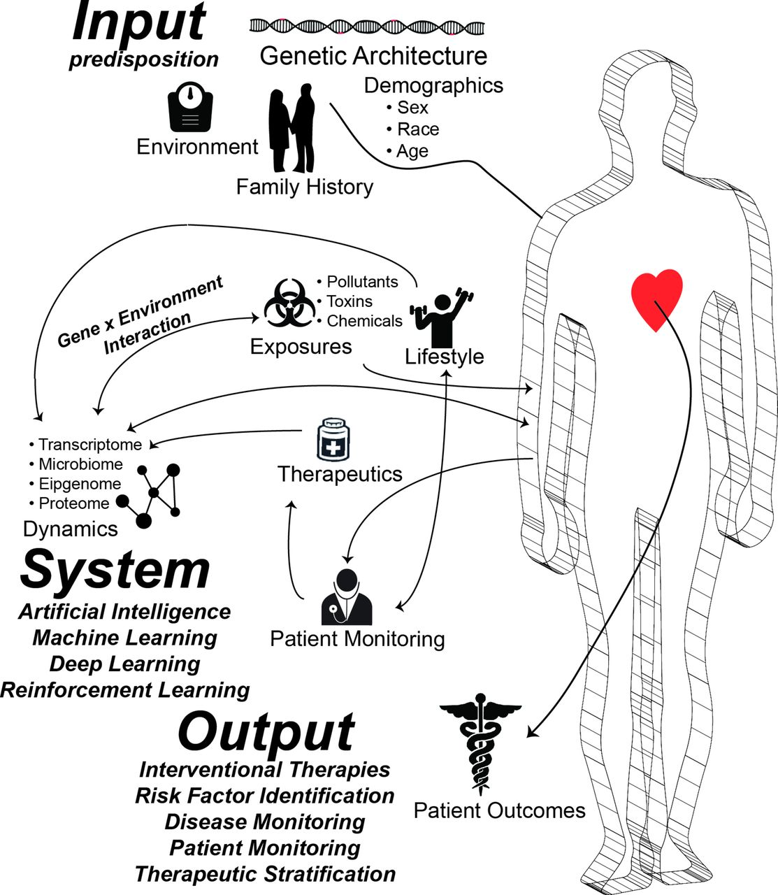
:::
::::

::: {.notes}
Voce docente (IT): nuova slide-dataset (richiesta esplicita). Cosa prevediamo, su chi,
dove si scarica, come si cita. ~32% eventi (classe positiva = morte) — è il seme della
scelta a due metriche più avanti. Anticipo la trappola del leakage (`time`), che
risolviamo allo step 01.
:::

## The variables — 11 predictors, one outcome

**Outcome** — `outcome`: `died` / `survived` (we make `died` the *first* level, so every
metric scores death as the positive class).

**Predictors (11), grouped:**

- *Demographics* — `age`, `sex`.
- *Comorbidities* — `anaemia`, `diabetes`, `high_blood_pressure`, `smoking`.
- *Labs & cardiac function* — `ejection_fraction` (pump efficiency), `serum_creatinine`,
  `serum_sodium`, `creatinine_phosphokinase`, `platelets`.

**Dropped on purpose** — `time` (follow-up days): it *leaks* the outcome (longer follow-up
is mechanically tied to who survives). Keeping it would inflate every score and fail in
the clinic.

::: {.notes}
Voce docente (IT): le covariate, raggruppate per leggibilità clinica. `ejection_fraction`
e `serum_creatinine` sono i predittori clinicamente forti (li ritroviamo nella VIMP
dell'Advanced). Ribadisco il drop di `time` = leakage. 11 predittori + outcome = 12
colonne dopo il wrangle.
:::

# Step 00 · Setup {#sec-00-setup .center}

<!-- Step 00 (demo, 10 min): open `.Rproj`, `renv::restore`, load with `here` + `rio`. -->

**Why first.** Every number we produce today is only as trustworthy as the project that produced it. So we start from a **healthy, reproducible environment** — before touching the data.

- Open the `.Rproj`; let `renv::restore()` rebuild the pinned library.
- Load data through `here::here()` (stable paths) and `rio::import()`.

::: {.notes}
Voce docente (IT): demo (~10 min). Apro col PERCHÉ: l'ambiente sano è la precondizione di
tutto. `renv` è già in restore in background dall'opening. Mostro `renv::status()` in sync e
`here::here()` alla root. Live-check al minuto 9: GREEN/RED.
:::

## A reproducible project — `renv`, `here`, `rio`

:::: {.columns}
::: {.column width="34%"}
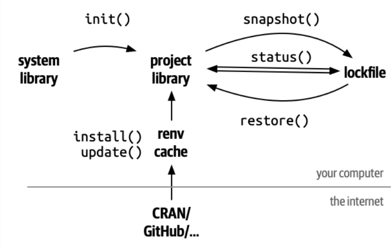
<p style="text-align:center; font-size:0.5em; color:#888; margin:0.2em 0;">UBEP ECDC R course (2023)</p>
:::
::: {.column width="33%"}

<p style="text-align:center; font-size:0.5em; color:#888; margin:0.2em 0;">Artwork by Allison Horst (CC BY 4.0)</p>
:::
::: {.column width="33%"}
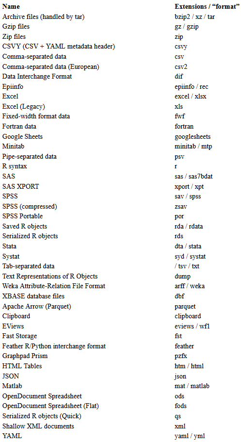
<p style="text-align:center; font-size:0.5em; color:#888; margin:0.2em 0;">UBEP ECDC R course (2023)</p>
:::
::::

- **`renv`** pins every package version: `renv::restore()` rebuilds the *exact* library on
  any machine, `renv::snapshot()` records what you used. No more "works on my laptop".
- **`here`** builds paths from the **project root**, not your working directory — so
  `here::here("data-raw", "x.csv")` works for everyone. Never `setwd()`.
- **`rio`** is one verb for many formats: `rio::import()` reads `.csv`, `.xlsx`, `.rds`… —
  it picks the right reader from the file extension.

::: {.notes}
Voce docente (IT): teoria dei tre pilastri base (richiesti dall'utente: spiegare ogni
comando non banale). renv = riproducibilità dell'ambiente; here = path stabili (no
setwd); rio = un import() per tutti i formati. Immagini: renv/rio dal mio corso ECDC,
here di Horst.
:::

## Live check — is your project healthy?

Run three checks. Signal **GREEN** if all pass, **RED** if any fails:

1. Is your **`.Rproj`** open (the project, not a loose script)?
2. Does **`renv::status()`** report the library **in sync** with the lockfile?
3. Does **`here::here()`** point to the **project root**?

::: {.notes}
Voce docente (IT): live-check min-09 (Engage). Presenza: alzata di mano GREEN/RED; remoto: poll.
:::

## GREEN — a healthy environment

All three pass:

- the `.Rproj` is open → the working directory is anchored to the project;
- `renv::status()` says *"The project is already synchronized with the lockfile"*;
- `here::here()` returns the project-root path (where `.Rproj` / `.here` lives).

**RED on any?** Fix it now — re-open the `.Rproj`, run `renv::restore()`, or check the `.here` sentinel — before the hands-on starts.

::: {.notes}
Voce docente (IT): Reveal min-09. Un ambiente sano è la precondizione: se RED, lo risolvo ora.
:::

## Go to code — `steps/00-setup/` {.center}

**Follow along.** Open `steps/00-setup/`, run `renv::restore()`, load the data with `here` + `rio`.

- Live check at minute 9: GREEN / RED.
- The folder is your snapshot — fall behind anywhere today and copy the next one.

::: {.notes}
Voce docente (IT): chiusura Step 00 (demo → "follow along"). Mentre parlo, `renv::restore()`
ha già scaldato in background.
:::

# Step 01 · Import & wrangle {#sec-01-import .center}

<!-- Step 01 (hands-on, 32 min): tidyverse primer; clean/recode with dplyr/tidyr and `|>`; outcome to factor; drop leaky `time`. -->

**Why this step.** Raw clinical data lies in two ways: messy names and types, and a column that *secretly encodes the outcome*. We tidy the first and **dodge the second — leakage** — before any model sees the data.

- A tidyverse primer: the native pipe `|>`, verbs that return a **new** tibble.
- Clean and recode with `dplyr`/`tidyr` + `janitor`; **drop the leaky `time`**; make the outcome an **event-first** factor.

::: {.notes}
Voce docente (IT): intro Step 01 (hands-on, ~32 min, il picco di carico-sintassi per chi parte
da zero). Apro col PERCHÉ (i due modi in cui i dati grezzi ingannano: nomi/tipi + leakage),
non con un elenco asettico. Rete fall-behind con `steps/01-import/`. Le 4 slide di teoria che
seguono coprono i concetti che poi le formative verificano.
:::

## The tidyverse — one grammar for data

:::: {.columns}
::: {.column width="60%"}
A family of packages that share **one design**: a tidy **tibble** goes in, a tidy tibble
comes out.

- A **tibble** is a data frame that prints cleanly and never surprises you (no silent type
  coercions, no row names).
- Every verb **returns a new tibble** — it does *not* edit in place. You build a result by
  **chaining** verbs, then assign once with `<-`.
- One consistent style across `dplyr`, `tidyr`, `ggplot2`, … — learn the grammar once,
  reuse it everywhere.
:::
::: {.column width="40%"}
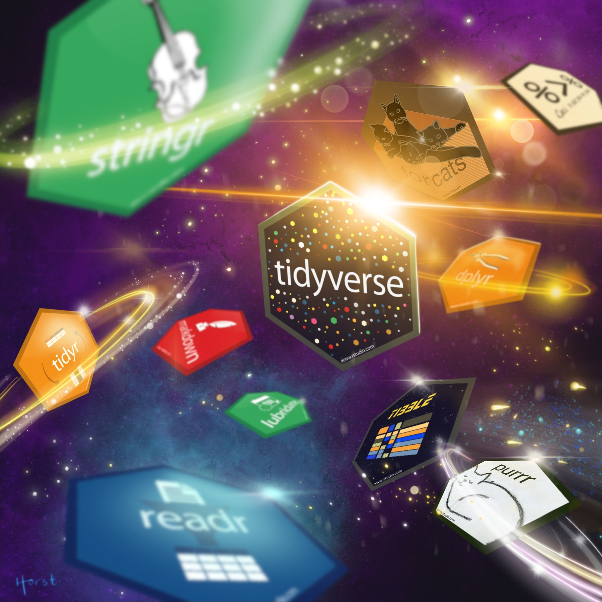
<p style="text-align:center; font-size:0.5em; color:#888; margin:0.2em 0;">Artwork by Allison Horst (CC BY 4.0)</p>
:::
::::

::: {.notes}
Voce docente (IT): cos'è il tidyverse e il modello mentale chiave = funzioni pure che
ritornano una NUOVA tibble (niente modifica in-place). Questo prepara il "your turn":
si concatena e si assegna una volta sola.
:::

## The native pipe `|>`

:::: {.columns}
::: {.column width="55%"}
The pipe sends the value on its **left** into the **first argument** of the function on its
**right**. It turns inside-out nesting into a left-to-right recipe.

`x |> f() |> g()`  **is**  `g(f(x))` — but you read it in the order it happens.

```r
hf_raw |>
  clean_names() |>
  select(-time) |>
  glimpse()
```

Read it aloud: *take the raw data, **then** clean the names, **then** drop `time`, **then**
look.* No temporary variables, no nested parentheses.
:::
::: {.column width="45%"}
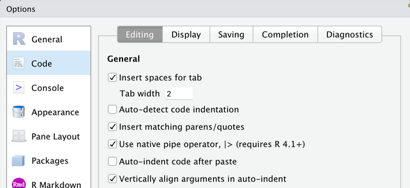
<p style="text-align:center; font-size:0.5em; color:#888; margin:0.2em 0;">UBEP ECDC R course (2023)</p>
:::
::::

::: {.notes}
Voce docente (IT): il pipe nativo `|>` (mai `%>%` nel codice del workshop). "then" è la
parola-chiave per leggerlo. Screenshot mio ECDC: come abilitarlo in RStudio
(Ctrl+Shift+M → native pipe).
:::

## Your turn — what does this pipeline do?

```r
hf_raw |> clean_names() |> select(ejection_fraction, age) |> filter(age > 60)
```

Which statement best describes what happens?

- **A.** The tibble flows in as the *first argument* of each verb, and each verb returns a *brand-new copy* — `hf_raw` is unchanged until you assign.
- **B.** The verbs edit `hf_raw` *in place* (like Stata's `keep if` / `drop`) — afterwards `hf_raw` itself has fewer rows and columns.
- **C.** `select(ejection_fraction, age)` fails — `ejection_fraction` and `age` are not objects in the global environment.
- **D.** The pipe forwards the *last object you created*, not the left-hand side.

*Pick one — then we reveal it.*

::: {.notes}
Voce docente (IT): MCQ min-31 (Engage), dopo la teoria del pipe. Distrattori diagnostici:
B = modello mentale in-place/Stata; C = NSE non capita; D = il pipe inoltra l'ultimo oggetto.
Li faccio votare PRIMA di scoprire la risposta (presenza: alzata di mano; remoto: poll).
:::

## The answer — A: functional, returns a new tibble

**✓ A.** The left-hand value enters the *first argument*; every verb returns a **new** tibble. `hf_raw` is untouched until you assign with `<-`.

- **✗ B** — *in-place / Stata mental model.* dplyr is functional: it returns a new object, the input stays intact.
- **✗ C** — *NSE not understood.* dplyr evaluates bare column names inside the data frame's scope (tidy/NSE), not as global variables.
- **✗ D** — *pipe forwards the LHS* — the value on its left — into the first argument, not "the most recent object".

::: {.notes}
Voce docente (IT): Reveal min-31. Il punto: pipeline funzionale, copia nuova, NSE. Se la sala
sceglie B è il misconcetto Stata da ri-spiegare prima del your-turn wrangle.
:::

## Reshaping with verbs — `dplyr`, `janitor`, `forcats`

:::: {.columns}
::: {.column width="58%"}
A handful of verbs do almost all of wrangling:

- `select()` — keep / drop **columns** (e.g. `select(-time)`).
- `mutate()` — **add or change** columns (e.g. build `outcome`).
- `filter()` — keep **rows** by a condition.
- `across()` — apply one transform to **many columns** at once.
- `janitor::clean_names()` — tidy, snake_case, machine-safe column names.
- `factor()` / `forcats` — turn text into a **factor** with explicit **levels**; we set
  `died` *first* so it is the positive class everywhere.
:::
::: {.column width="42%"}
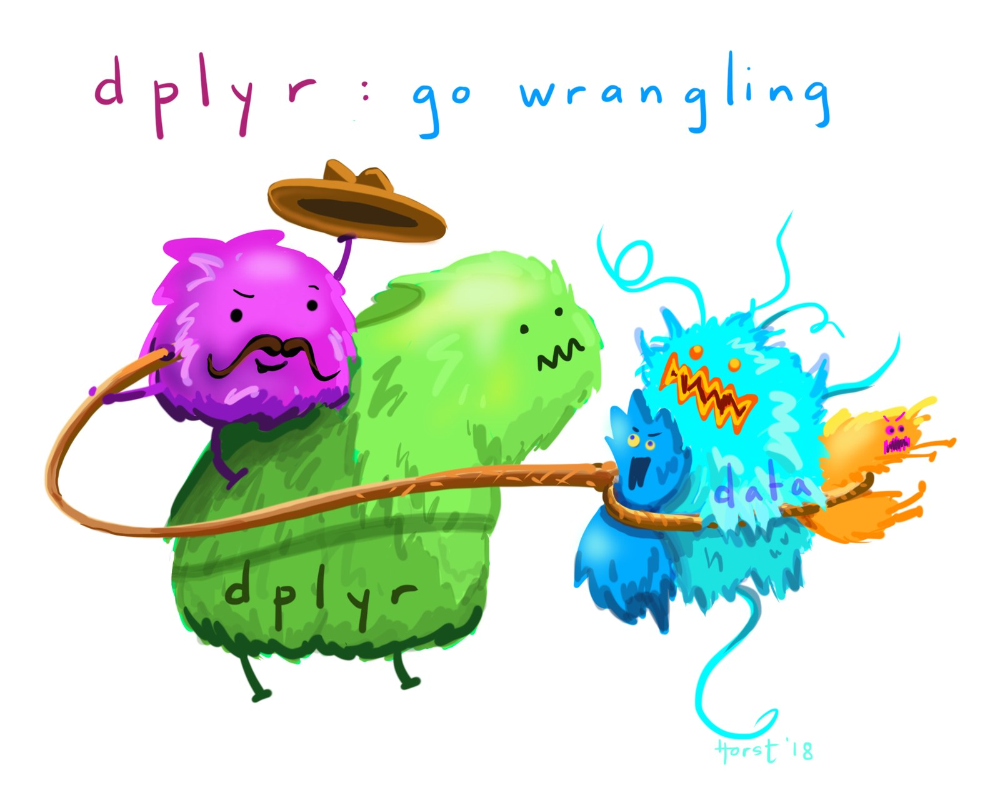
<p style="text-align:center; font-size:0.5em; color:#888; margin:0.2em 0;">Artwork by Allison Horst (CC BY 4.0)</p>
:::
::::

::: {.notes}
Voce docente (IT): i verbi che useremo davvero nel "your turn" — select/mutate/filter/
across, clean_names, factor con livelli. La convenzione EVENT-FIRST (`died` primo) è ciò
che rende le metriche automatiche più avanti.
:::

## Tidy data — and the leakage trap

:::: {.columns}
::: {.column width="45%"}
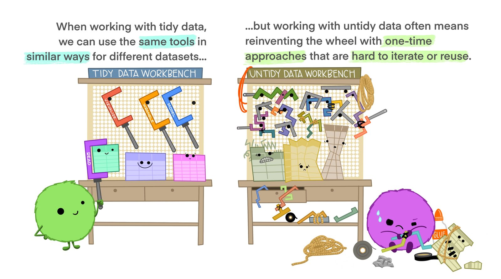
<p style="text-align:center; font-size:0.5em; color:#888; margin:0.2em 0;">Tidy data art: Lowndes & Horst, Openscapes (CC BY 4.0)</p>
:::
::: {.column width="55%"}
**Tidy data:** each **variable** is a column, each **observation** a row, each **cell** one
value. Tidy in $\to$ everything downstream just works.

**Leakage:** a predictor that secretly encodes the outcome. Here `time` (follow-up days) is
mechanically longer for survivors — a model that uses it "predicts" death by *cheating*,
scores beautifully in the slides, and **fails in the clinic**.

- The fix is one line — `select(-time)` — but spotting leakage is a **clinical-judgement**
  skill, not a coding one. Always ask: *could this column only be known after the outcome?*
:::
::::

::: {.notes}
Voce docente (IT): tidy data (1 var/colonna, 1 oss/riga, 1 valore/cella) + la
mini-lezione di LEAKAGE che giustifica il drop di `time`. Il messaggio forte: il leakage
si riconosce col ragionamento clinico, non col codice.
:::

## Your turn — build the analysis cohort

From the imported `hf_raw`, build `hf` with a **single `|>` chain**:

1. `clean_names()` — snake_case the names.
2. `select(-time)` — drop the follow-up duration (it leaks the outcome).
3. Make `outcome` a two-level factor, **event first** (`"died"`, `"survived"`) from `death_event`; then drop `death_event`.
4. Make the 0/1 flags (`anaemia, diabetes, high_blood_pressure, sex, smoking`) factors.
5. `glimpse()` — confirm **12 columns** and the factor.

*Your turn — type it at the R prompt.*

::: {.notes}
Voce docente (IT): your-turn min-30 (Engage), il task integrativo dello step. Lo studente lo
scrive AL PROMPT R sul proprio laptop (o apre `steps/01-import/` se è rimasto indietro). Do
~3 min di timer. "Type it" = la doctrine live: si scrive, non si incolla. Poi col my-turn lo
risolvo dal vivo.
:::

## My turn — the wrangle, one chain

```r
hf <- hf_raw |>
  clean_names() |>
  select(-time) |>
  mutate(
    outcome = factor(
      if_else(death_event == 1, "died", "survived"),
      levels = c("died", "survived"),
    ),
  ) |>
  select(-death_event) |>
  mutate(across(c(anaemia, diabetes, high_blood_pressure, sex, smoking), factor)) |>
  glimpse()
```

Each verb takes the tibble first and returns a **new** tibble — the chain never mutates `hf_raw`.

**Going further.** Why is `time` leakage? It is follow-up days *until death-or-censoring* — partly a function of the outcome (patients who die early have small `time`). A model handed `time` "predicts" death by reading its own answer: deceptively high in training, collapses in prospective use. A predictor must be knowable **at the moment you would predict**.

::: {.notes}
Voce docente (IT): Reveal/my-turn min-30. Live-codo la catena. "Going further" = ex-stretch
(Davide), de-personalizzato: il leakage si riconosce col ragionamento clinico, non col codice.
:::

## Go to code — `steps/01-import/` {.center}

Now **do it in the project**: open `steps/01-import/` and run the wrangle end to end.

- Type it, run it — the snapshot in `steps/01-import/` is your safety net.
- The *solution* of this step is the *start* of the next.
- **Fell behind?** Copy `steps/02-eda/` and you are back in sync.

::: {.notes}
Voce docente (IT): chiusura Step 01 → hands-on nel progetto. Pattern "Go to code" di
riferimento: cosa fare nel folder + rete checkpoint (la soluzione dello step N è l'inizio di
N+1) + bridge al prossimo. Per gli step demo diventa "follow along".
:::

# Step 02 · Clinical EDA {#sec-02-eda .center}

<!-- Step 02 (hands-on, 22 min): tbl_summary(by = outcome); one ggplot; read imbalance -> metric choice. -->

**Why this step.** Before modelling, *read the cohort* — a model is only as honest as your grasp of its data. The shape we find here, especially the **class imbalance**, drives the metric choice for the rest of the day.

- `gtsummary::tbl_summary(by = outcome)` — a clinical Table 1.
- One `ggplot` of a predictor against the outcome; **read the ~32% imbalance** $\to$ the dual metric.

::: {.notes}
Voce docente (IT): hands-on elastico (~22 min, comprimibile). Apro col PERCHÉ: l'imbalance
~32% visto qui è il seme del ragionamento "accuracy inganna → due metriche".
:::

## `gtsummary` — a clinical Table 1

:::: {.columns}
::: {.column width="58%"}
`tbl_summary(by = outcome)` builds the **publication-style "Table 1"** clinicians already
read: one row per variable, one column per outcome group, with sensible summaries chosen
automatically (median [IQR] for numbers, n (%) for categories).

```r
hf |>
  tbl_summary(by = outcome)
```

- It is **descriptive, not a test** — it shows *where* the groups differ, which is how you
  build intuition *before* any model.
- Reading it here, you already see the **imbalance** (~32% deaths) that will steer the
  metric choice.
:::
::: {.column width="42%"}
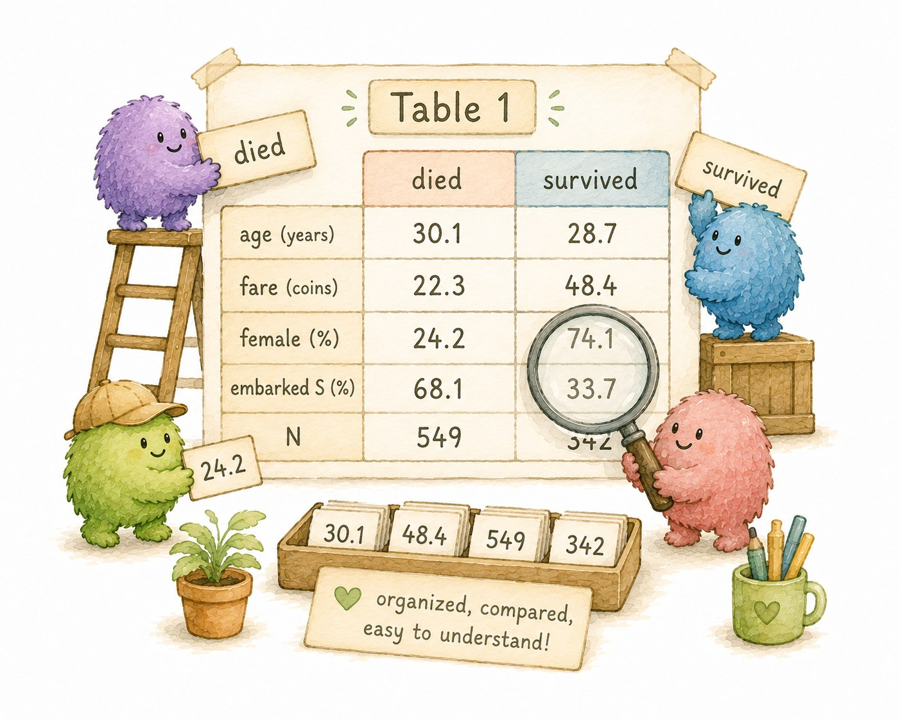
<p style="text-align:center; font-size:0.5em; color:#888; margin:0.2em 0;">Illustration generated with Images2.0 (illustrative figures, not our cohort)</p>
:::
::::

::: {.notes}
Voce docente (IT): gtsummary = la "Table 1" che il clinico riconosce. Descrittiva, non
inferenza. Immagine Images2.0 (img/horststyle/gtsummary.jpg): i NUMERI nell'illustrazione
sono di esempio, NON la nostra coorte — lo dico per onestà (la Table 1 vera è quella che
generiamo dal vivo allo step 02).
:::

## `ggplot2` — the grammar of graphics

:::: {.columns}
::: {.column width="55%"}
A plot is built in **layers**, added with `+`:

```r
hf |>
  ggplot(aes(x = outcome, y = ejection_fraction)) +
  geom_boxplot()
```

- **data** piped in, then `aes()` **maps** variables to position / colour / fill…
- **geoms** (`geom_boxplot`, `geom_point`, …) draw the data.
- add `+ theme_*()`, `+ labs()` to refine. The *same* grammar builds every chart.
:::
::: {.column width="45%"}
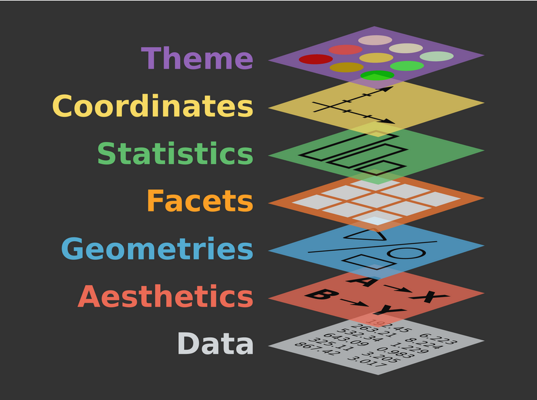
<p style="text-align:center; font-size:0.5em; color:#888; margin:0.2em 0;">UBEP ECDC R course (2023)</p>
:::
::::

::: {.notes}
Voce docente (IT): ggplot = grammatica a layer. Dati nel `|>`, layer con `+`, poi
`ggsave()`. Una sola grammatica per ogni grafico. Diagramma dei layer dal mio corso
ECDC.
:::

## Your turn — why watch AUC-PR too?

Death occurs in about **32%** of patients, and we score every model with **both** AUC-ROC **and** AUC-PR. Why watch **AUC-PR alongside** AUC-ROC, not AUC-ROC alone?

- **A.** AUC-PR focuses on the *death* class; its no-skill baseline is the *prevalence* ($\approx 0.32$), not 0.5 — so it exposes poor performance on the patients we care about that a flattering AUC-ROC can hide.
- **B.** AUC-ROC and AUC-PR always rank models the same way — AUC-PR is a redundant second opinion.
- **C.** Like AUC-ROC, AUC-PR's no-skill baseline is always 0.5.
- **D.** Under imbalance AUC-ROC cannot be computed; AUC-PR is its only valid replacement.

*Pick one — then we reveal it.*

::: {.notes}
Voce docente (IT): MCQ min-50 (Engage). Distrattori: B = metriche intercambiabili; C = baseline
PR = 0.5; D = imbalance "rompe" la ROC. Li faccio votare prima del reveal.
:::

## The answer — A: AUC-PR is anchored to prevalence

**✓ A.** AUC-PR scores the positive (death) class; its no-skill line is the prevalence ($\approx 0.32$), so it stays meaningful as the event gets rarer.

- **✗ B** — *interchangeable.* The two can and do disagree — that is the whole reason to watch both.
- **✗ C** — *PR baseline is 0.5.* No: the AUC-PR no-skill line is the prevalence itself; a "0.6" at 32% is far less impressive than it looks.
- **✗ D** — *imbalance breaks AUC-ROC.* AUC-ROC is perfectly computable under imbalance — it just does not, alone, speak about the minority class.

::: {.notes}
Voce docente (IT): Reveal min-50. La lezione: due metriche complementari; la PR è ancorata
alla prevalenza. Atterra prima dello step 03/04 dove leggo ROC+PR.
:::

## Where today's model fits — learning paradigms

Today we do **supervised** learning: every patient carries a known label (`died` /
`survived`) and the model learns the mapping from features to label.

- **Supervised** — labelled outcome; *classification* (our case) or *regression*. ← today
- **Unsupervised** — *no* labels; find structure (clustering, PCA). You met it in the
  Overview; out of scope here so we can do **one** supervised pipeline thoroughly.
- **Reinforcement** — an agent learns from **rewards** by acting, not from a table of
  labels (think treatment policies that improve with feedback).
- **Active / online** — the model **asks** for the most useful next label, or keeps
  learning as data **streams** in.

One labelled table, one clear target: that is *why* supervised methods fit this problem.

::: {.notes}
Voce docente (IT): ex-"supervised vs unsupervised" (slide 8), tolto il fragment e
ESPANSO ai quattro paradigmi (supervised oggi, + unsupervised, reinforcement, active/
online) come chiesto. Inquadra perché il nostro problema è supervised. Nessuna rivelazione
incrementale.
:::

## Go to code — `steps/02-eda/` {.center}

Open `steps/02-eda/`: build the Table 1 and one plot, and read the imbalance.

- Keep it short — EDA is elastic; the metric lesson is the keeper.
- **Behind?** Copy `steps/03-logistic/` and you are back in sync.

::: {.notes}
Voce docente (IT): chiusura Step 02. La slide "learning paradigms" resta come ponte verso lo
step 03 (supervised). Il folder 02-eda è comprimibile se sono in ritardo.
:::

# Step 03 · Logistic spine {#sec-03-logistic .center}

<!-- Step 03 (hands-on, 38 min): object-map rsample -> recipes -> parsnip -> workflows -> yardstick; glm baseline. -->

**Why this step.** Four algorithms are coming — and we do *not* want four bespoke pipelines. We lay **one reusable spine** now, on a model we can read (`glm`), so Step 04 changes only **one line**.

- Walk the object-map `rsample` $\to$ `recipes` $\to$ `parsnip` $\to$ `workflows` $\to$ `yardstick`.
- Fit a plain `glm` baseline; score it with `yardstick` — **AUC-ROC and AUC-PR**.

::: {.notes}
Voce docente (IT): hands-on (~38 min), picco di profondità (la object-map). Apro col PERCHÉ:
una spina riusabile + glm come ancora di riconoscimento, non nuova astrazione. Break dopo lo step.
:::

## tidymodels — one spine, five packages

:::: {.columns}
::: {.column width="55%"}
**tidymodels** is the tidyverse for modelling: the *same* five-package spine fits **any**
algorithm. Learn it once on a logistic regression; reuse it for the whole zoo.

- You declare *what* you want (a model **spec**), not *how* each engine wants its inputs.
- Swapping algorithm = changing **one line** (the `parsnip` spec). Everything else holds.
- Because the recipe and model travel together in a **workflow**, preprocessing can never
  leak from test into train.
:::
::: {.column width="45%"}
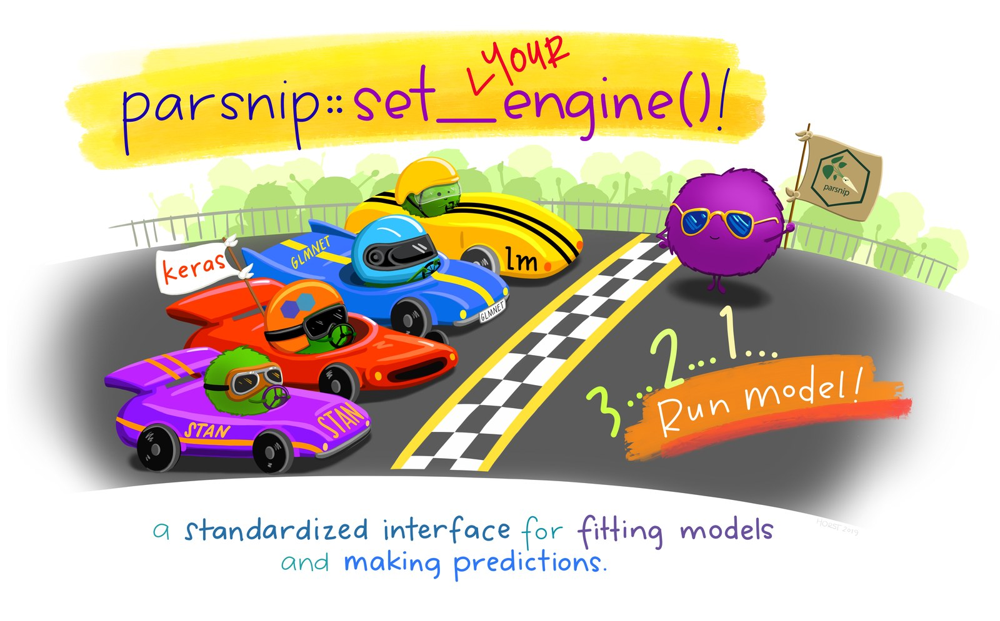
<p style="text-align:center; font-size:0.5em; color:#888; margin:0.2em 0;">parsnip <code>set_engine()</code> — Artwork by Allison Horst (CC BY 4.0)</p>
:::
::::

::: {.notes}
Voce docente (IT): cosa è tidymodels e perché conviene = una spina riusabile, engine-swap
in una riga, niente leakage grazie al workflow. Prepara la object-map e lo step 04.
:::

## The tidymodels object-map

One spine, reused all afternoon. **Five objects, one chain:**

```{=html}
<style>
#sec-object-map svg { max-width: 100% !important; height: auto !important; display: block; margin: 0.3em auto; }
</style>
```

::: {#sec-object-map}
```{mermaid}
%%{init: {'flowchart': {'nodeSpacing': 26, 'rankSpacing': 40, 'padding': 16}, 'themeVariables': {'fontSize': '24px'}}}%%
flowchart LR
  RS["rsample<br/>split<br/>train / test"] --> RC["recipes<br/>preprocess"]
  RC --> PS["parsnip<br/>model spec"]
  PS --> WF["workflows<br/>recipe<br/>+ model"]
  WF --> YS["yardstick<br/>score:<br/>ROC + PR AUC"]
```
:::

- **`rsample`** — `initial_split()` / `vfold_cv()`: who trains, who tests.
- **`recipes`** — dummy-code, drop zero-variance, normalize.
- **`parsnip`** — declare the model once, engine-agnostic.
- **`workflows`** — bundle recipe + spec so nothing leaks.
- **`yardstick`** — `roc_auc()`, `pr_auc()`: two complementary scorers.

::: {.notes}
Voce docente (IT): la mappa è la spina dorsale del pomeriggio. Lo step 04 cambia solo il
nodo `parsnip` (engine-swap) e moltiplica per quattro: "1 cosa, 4 manopole", non 4
pipeline. Font del mermaid ingrandito (22px) e tolto `.smaller`.
:::

## The five packages — and the functions we use

| package | role | the calls you will type |
|---|---|---|
| `rsample` | split & resample | `initial_split()`, `training()`, `testing()`, `vfold_cv()` |
| `recipes` | preprocess | `recipe()`, `step_dummy()`, `step_zv()`, `step_normalize()` |
| `parsnip` | model spec | `logistic_reg()`, `set_engine()`, `set_mode()` |
| `workflows` | bundle | `workflow()`, `add_recipe()`, `add_model()`, `fit()` |
| `yardstick` | score | `metric_set()`, `roc_auc()`, `pr_auc()`, `augment()` |

The same five every time. Step 04 changes only the `parsnip` line — four times — and wraps
the tuning around it.

<p style="text-align:center; margin:0.6em 0 0 0;">
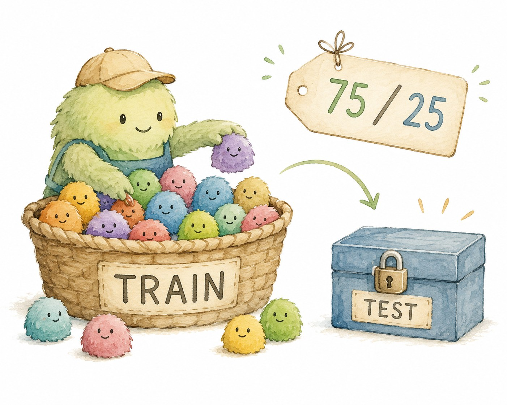
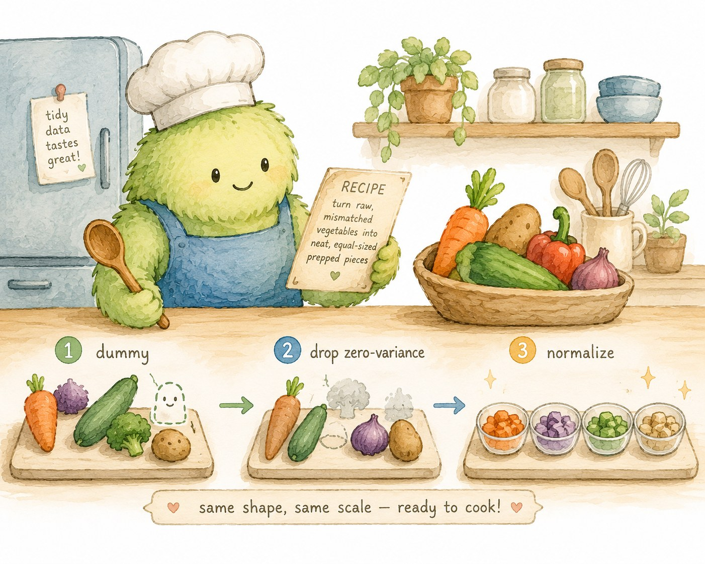
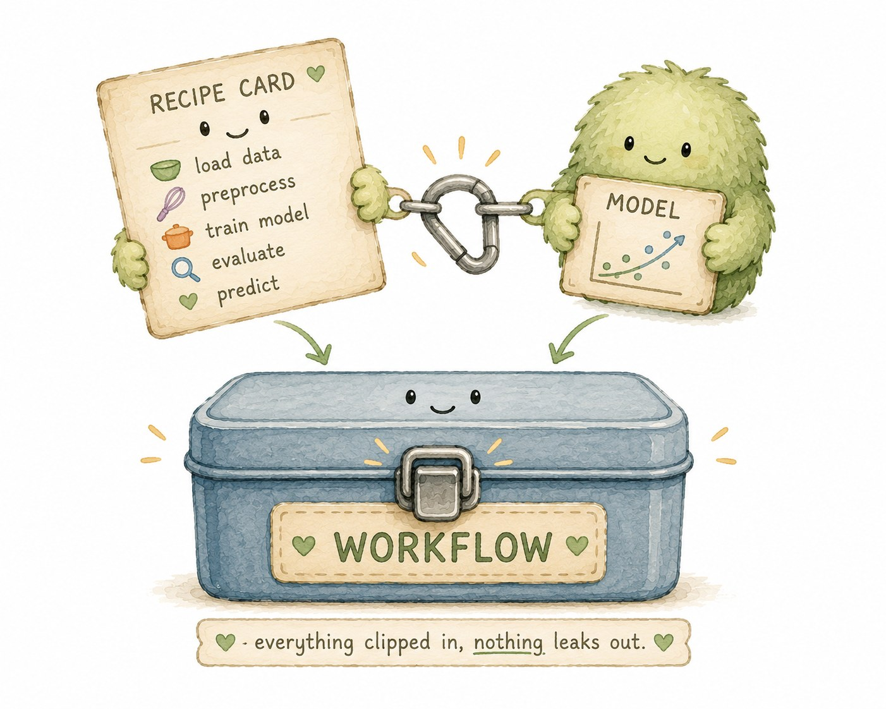
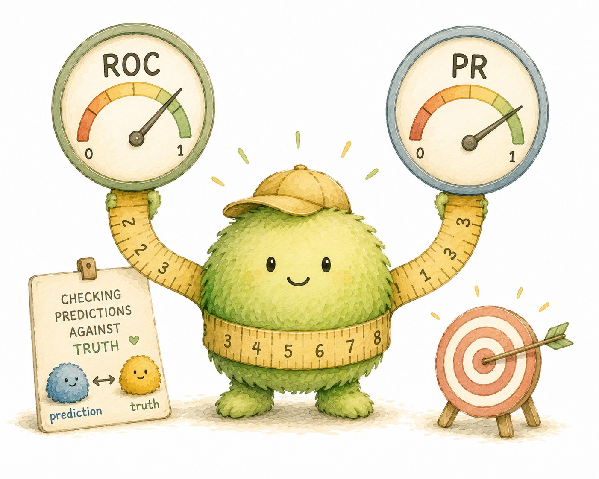
</p>
<p style="text-align:center; font-size:0.5em; color:#888; margin:0;">rsample · recipes · workflows · yardstick — illustrations generated with Images2.0</p>

::: {.notes}
Voce docente (IT): risponde alla richiesta esplicita — i 5 pacchetti E le funzioni che
useremo davvero, in una tabella di riferimento, più la striscia di 4 card Images2.0
(rsample/recipes/workflows/yardstick). Tabella a font pieno per leggibilità da fondo aula.
:::

## Your turn — do the two routes agree?

You fit a plain `glm` logistic two ways: (a) a bare `glm`-engine `logistic_reg()`, and (b) the same model wrapped in a `workflow()` (recipe + spec). Score both on the test set with **both** metrics:

```r
hf_metrics <- metric_set(roc_auc, pr_auc)
... |> augment(new_data = test) |> hf_metrics(truth = outcome, .pred_died)
```

(No `event_level` needed — `died` is the first level.) **Do the two routes give the same AUC-ROC and AUC-PR? Why, in one sentence?**

::: {.notes}
Voce docente (IT): your-turn min-72 (Engage). Lo studente lo prova al prompt; ~2-3 min.
:::

## My turn — same model, more scaffolding

**Yes — identical** across both routes. The `workflow` does not change the statistical model; it only **bundles** the recipe and the spec so the *same* logistic regression is fit on the *same* preprocessed data. The estimator is identical $\to$ the numbers match.

**Going further.** What does recipe + workflow *buy* you over a bare `glm`? It makes preprocessing **part of the model** (dummy-coding, normalization, zero-variance removal travel with the fit), re-applied identically at prediction time — no leakage, no "I forgot to scale the test set" — and the whole thing becomes one swappable, tunable object: exactly what lets Step 04 swap engines and tune four models at once.

::: {.notes}
Voce docente (IT): Reveal/my-turn min-72. "Same model, more scaffolding". Going further =
ex-stretch: cosa compra recipe+workflow vs glm nudo.
:::

## Your turn — logistic → random forest, minimal change?

You built a logistic-regression workflow. To turn it into a **random forest** workflow on the *same* data, what is the **minimal** change?

- **A.** Change *only the model spec* — swap `logistic_reg() |> set_engine("glm")` for `rand_forest() |> set_engine("ranger")`. Split, recipe, workflow scaffold stay identical.
- **B.** Rewrite the recipe and the train/test split to suit the new algorithm.
- **C.** Abandon the tidymodels scaffold and call `ranger::ranger()` directly with its own formula.
- **D.** Keep `logistic_reg()` and just change `set_mode()` from `"classification"` to `"regression"`.

*Pick one — then we reveal it.*

::: {.notes}
Voce docente (IT): MCQ min-88 (Engage), pre-break. Distrattori: B = riscrivi recipe/split per
algoritmo; C = torni a funzioni package-specifiche; D = confonde MODE con ENGINE.
:::

## The answer — A: change only the spec

**✓ A.** One line — the `parsnip` spec. The split, recipe and workflow are model-agnostic.

- **✗ B** — *rewrite recipe/split per algorithm.* Preprocessing and split are shared; bespoke pipelines defeat the engine-swap idiom.
- **✗ C** — *back to package-specific functions.* `parsnip` is the unified front-end; calling `ranger()` directly loses the one-line swap.
- **✗ D** — *confuses MODE with ENGINE.* Mode = classification vs regression; it does not turn logistic into a forest.

::: {.notes}
Voce docente (IT): Reveal min-88. L'idiom engine-swap: "1 cosa, 4 manopole", non 4 pipeline.
Prepara lo step 04.
:::

## Go to code — `steps/03-logistic/` {.center}

Open `steps/03-logistic/`: lay the spine and fit the `glm` baseline.

- Build the object-map once — Step 04 only swaps the `parsnip` line.
- **Behind?** Copy `steps/04-zoo/` and you are back in sync.

*Break next — then the zoo.*

::: {.notes}
Voce docente (IT): chiusura Step 03 + annuncio del break. Dopo il break entro nello step 04
(picco di ampiezza) con la teoria già "compilata".
:::

# Hyperparameters, one algorithm at a time {.center}

A **hyperparameter** is a setting you fix *before* fitting — unlike the ordinary
parameters (coefficients, split points) that the fit *learns* from the data. Same spine,
**one hyperparameter at a time**: *what it is* $\to$ *what it controls* $\to$ *its effect on
bias / variance / overfitting.*

::: {.notes}
Voce docente (IT): le 4 slide-iperparametro precedono il tuning. Definisco subito
"iperparametro" (scelto prima del fit) vs "parametro" (appreso) — così rispondo al
"perché non chiamarli iperparametri": ora li chiamiamo così. Una slide ~4 min ciascuna,
non si tuna ancora nulla.
:::

## Penalized logistic — `penalty` / `mixture`

The `glm` baseline, **regularized**: shrink coefficients to trade a little bias for much
less variance.

| hyperparameter | what it means | effect |
|---|---|---|
| `penalty` ($\lambda$) | strength of shrinkage toward 0 | $\uparrow$ penalty $\to$ more bias, less variance (guards overfit); too high $\to$ underfit |
| `mixture` ($\alpha$) | ridge $\leftrightarrow$ lasso dial | `0` = **ridge** (shrink all); `1` = **lasso** (some coefs $\to$ exactly 0, *selects*); in between = **elastic-net** |

- Engine `glmnet`; both left as `tune()` in the `workflow_set`.

::: {.notes}
Voce docente (IT): collega al glm dello step 03 — "stesso modello, con un freno".
`mixture` sceglie *come* si penalizza (ridge/lasso/elastic-net); lasso fa anche selezione
(coef esattamente 0). Tolto il bullet-slogan; mantenuto engine + tune.
:::

## $k$-NN — `neighbors`

Predict from the **$k$ closest** patients. The single hyperparameter `neighbors` *is* the
bias–variance dial.

| `neighbors` ($k$) | behaviour | bias / variance |
|---|---|---|
| **small** $k$ (e.g. 1–3) | follows local noise, jagged boundary | low bias, **high variance** (overfits) |
| **large** $k$ | averages over many neighbours, smooth boundary | **high bias**, low variance (can underfit) |

- **Range.** $k$ runs from $1$ to $n_{\text{train}}$: at $k = 1$ it memorizes, at
  $k \to n$ it just predicts the majority class. The good value is **interior**, so we
  **tune** it.
- Engine `kknn`; `neighbors` left as `tune()`.

::: {.notes}
Voce docente (IT): qui atterra la MCQ del min 118 (direzione bias-variance di k). Tolto il
bullet-slogan ("più k sempre meglio"/"solo velocità"); aggiunto il RANGE 1..n_train e
l'idea che l'ottimo è interno → si tuna. Engine + tune come gli altri.
:::

## SVM (RBF) — `cost` / `rbf_sigma`

Separate the classes with a **margin**; the RBF kernel lets the boundary curve.

| hyperparameter | what it means | effect |
|---|---|---|
| `cost` ($C$) | penalty for margin violations | $\uparrow$ cost $\to$ harder margin, fits training tighter $\to$ lower bias, **higher variance** |
| `rbf_sigma` ($\sigma$) | how fast a patient's influence **fades** with distance | see below |

**`rbf_sigma`, in words.** The RBF kernel rates two patients by a similarity that *fades
with distance*; $\sigma$ sets **how fast** it fades. **Small $\sigma$** $\to$ influence
reaches far $\to$ a smooth, almost-linear boundary (**more bias**). **Large $\sigma$** $\to$
influence is very local $\to$ the boundary wiggles around individual points (**more
variance**, overfit risk).

- Engine `kernlab`; `cost` and `rbf_sigma` are `tune()`d together (they interact).

::: {.notes}
Voce docente (IT): CORREZIONE rispetto alla versione precedente — la direzione di
`rbf_sigma` era invertita. In kernlab il kernel è $\exp(-\sigma\,\lVert x-x'\rVert^2)$:
$\sigma$ ALTO = decadimento rapido = influenza LOCALE = confine ondulato = più varianza;
$\sigma$ BASSO = portata ampia = confine liscio = più bias. Spiegato a parole come chiesto.
:::

## Random forest — `mtry` / `min_n` / `trees`

Many decorrelated trees, **averaged**. Two hyperparameters we tune — and one quantity we
just set large enough.

| setting | what it means | effect |
|---|---|---|
| `mtry` | predictors offered at each split | small `mtry` $\to$ trees more **decorrelated** $\to$ lower variance; large $\to$ trees agree more |
| `min_n` | minimum samples in a leaf | large `min_n` $\to$ shallower, simpler trees (more bias, less variance) |
| `trees` | number of trees | a **convergence** quantity, *not* a tuning dial — see below |

**`trees` is not a hyperparameter to tune.** More trees never overfit; they only shrink
Monte-Carlo noise until the averaged prediction **converges**. Cost grows **linearly** with
`trees`, so the only task is to set it **large enough to have converged** — bigger than
that is wasted compute, not better accuracy. A converged-but-oversized forest needs **no**
refit at a smaller value (the answer won't change); you'd revisit `trees` only if the
*problem itself* changes. So we **tune** `mtry` / `min_n` and merely **fix** `trees` large.

- Engine `ranger`; `mtry` and `min_n` are `tune()`d, `trees` is set (not tuned).

::: {.notes}
Voce docente (IT): punto chiave (e accordo con l'utente) — `trees` NON è una manopola di
overfit né da tunare: è una quantità di CONVERGENZA. Costo lineare nei trees → metterne
"ancora di più" è inutile; basta garantire la convergenza. Non si riaddestra più piccolo
se era sovradimensionato (stesso risultato); si rivede solo se cambia il problema.
:::

# Step 04 · The model zoo, tuned & validated {#sec-04-zoo}

<!-- Step 04 (hands-on, 68 min): workflow_set + workflow_map; tune over vfold_cv; rank_results; finalize; last_fit. -->

The **zoo** = the four model families (penalized logistic, $k$-NN, RBF-SVM, random forest)
brought together to compete — fairly, once.

- Bundle the four specs into **one** `workflow_set`; tune all with `workflow_map("tune_grid")`.
- Tune over **one shared** `vfold_cv(v = 5)`; `rank_results()` / `autoplot()` to compare.
- `finalize` the winner; `last_fit()` **once** on the untouched test set.

<p style="text-align:center; margin:0.8em 0 0 0;">
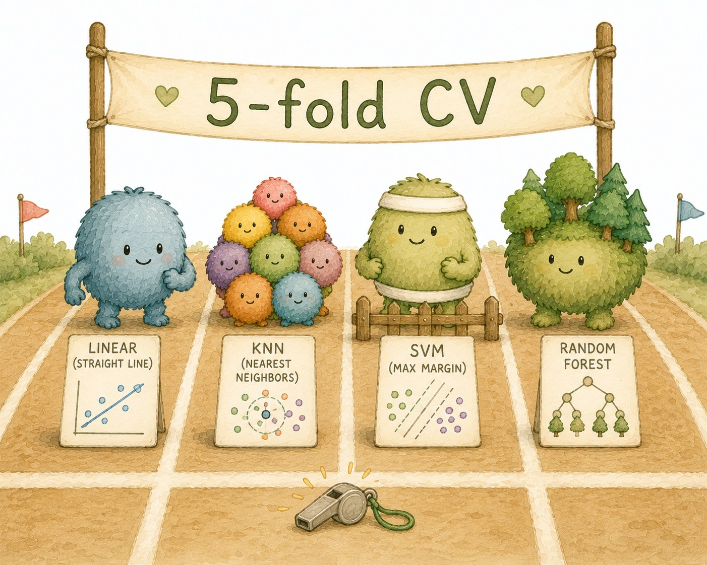
<span style="display:block; font-size:0.5em; color:#888;">The four families racing on one shared 5-fold CV — illustration generated with Images2.0</span>
</p>

::: {.notes}
Voce docente (IT): hands-on, il CUORE (~68 min). "Zoo" = metafora delle quattro famiglie
di modelli messe in gara insieme (glossato in slide, niente termine tecnico nascosto). Un
solo oggetto `folds` riusato per tutti. "Your turn" culminante al min 150. Convenzione
EVENT-FIRST (`died` primo) → niente `event_level` nel codice. Parallelo `future`
OPZIONALE (a N=299 il tuning è di ~secondi).
:::

## Tuning machinery — `workflow_set`, `tune_grid`, CV

:::: {.columns}
::: {.column width="55%"}
- **`vfold_cv(v = 5)`** splits *train* into 5 folds; each model is scored on each held-out
  fold and averaged — an honest estimate that **never touches the test set**.
- **`workflow_set()`** bundles {one recipe} × {four specs} into four workflows at once.
- **`workflow_map("tune_grid", grid = 8)`** tries 8 hyperparameter combos per model over the
  folds, scoring **both** metrics.
- **`rank_results()` / `autoplot()`** compare; **`select_best()` + `finalize_workflow()`**
  lock the winner's settings; **`last_fit()`** trains on all of *train* and scores **once**
  on *test*.
:::
::: {.column width="45%"}
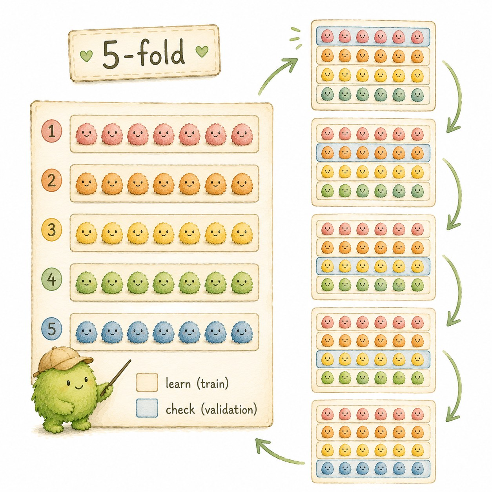
<p style="text-align:center; font-size:0.5em; color:#888; margin:0.2em 0;">5-fold CV — illustration generated with Images2.0</p>
:::
::::

::: {.notes}
Voce docente (IT): spiega i comandi "non base" dello step 04 (richiesta esplicita):
vfold_cv, workflow_set, workflow_map/tune_grid, rank_results, select_best, finalize,
last_fit. Immagine CV friendly (Images2.0); la metafora "gara" (workflowset.png) è sulla
slide-titolo dello Step 04.
:::

## Two metrics — and why a single split lies

**Why two.** With a ~32%-event outcome, "always predict *survived*" is ~68% accurate and
clinically useless. We watch two complementary numbers:

- **AUC-ROC** — ranking of risk across all thresholds; prevalence-free, chance $= 0.5$.
- **AUC-PR** — performance on the *positive* (death) class; its no-skill baseline is the
  prevalence ($\approx 0.32$), so it stays meaningful when the event is rare.

**Why cross-validate.** A single ~75-patient test split is **high-variance**: by luck it can
*flatter a weak model* — even make a plain `glm` look unbeatable — while 5-fold CV, which
averages over five held-out slices, gives the **honest** comparison. Across the zoo the
**random forest typically leads on CV** while the linear models trail; the test set then
confirms the *finalized* winner once.

> **Numbers are read live.** Exact AUCs depend on the seed and the run, so we read them from
> the **live execution**, not from the slide. What is stable is the **pattern**:
> cross-validation is the honest ranking, and one number on a small cohort is luck.

**Aside (no numbers needed).** AUC-ROC is **symmetric** — the positive class doesn't change
it. AUC-PR is **not**: it depends on the positive class, which is exactly why we put `died`
*first*, so both metrics score death by default. Moving the decision threshold by a clinical
false-negative / false-positive cost ratio is a deliberate **Advanced** topic; here we stop
at threshold-free ranking.

::: {.notes}
Voce docente (IT): RIVISTA come da feedback. Tolti tutti i numeri hard-coded (erano del run
di test e diventerebbero falsi al render live) e tolti i fragment/incrementali. Resta il
ragionamento di merito: perché DUE metriche, perché la CV è il confronto onesto (un singolo
split piccolo può lusingare un modello debole), e il pattern atteso (forest in testa in CV).
I numeri si leggono dall'esecuzione live. L'aside simmetria/asimmetria resta concettuale.
:::

# Step 05 · Reproducible report {#sec-05-report}

<!-- Step 05 (demo, 13 min): render the report that RUNS the whole analysis; renv::snapshot; pre-hook to Advanced. -->

**Objectives.** Ship the deliverable — reproducible *because* it runs the analysis.

- The report `.qmd` **runs the whole pipeline in one render** — split $\to$ recipe $\to$ tune
  $\to$ finalize $\to$ `last_fit` $\to$ tables & curves — so every number is produced by the
  *same* run that prints it. Nothing cached by hand, nothing to drift.
- Close with `renv::snapshot()`: pinned env + `here` + `set.seed` = a colleague re-runs it and
  gets the same report.

<p style="text-align:center; margin:0.7em 0 0 0;">
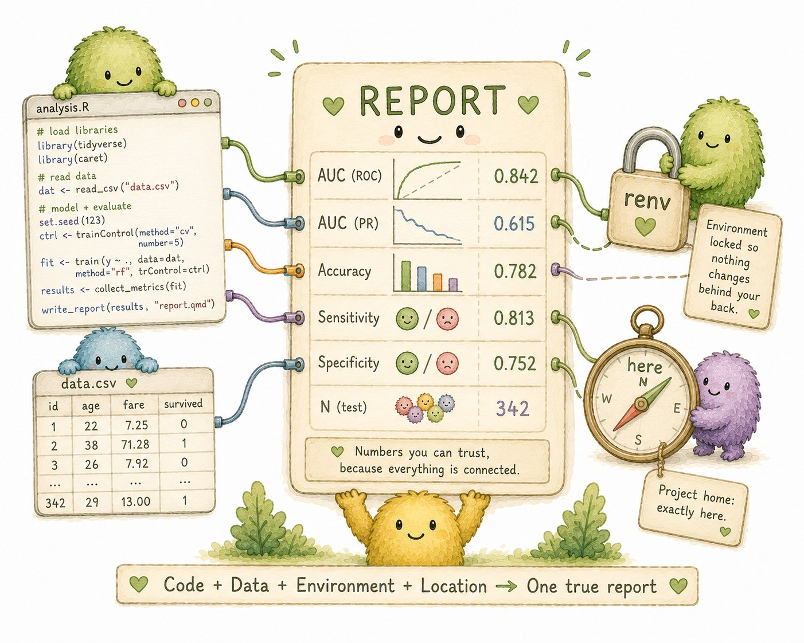
<span style="display:block; font-size:0.5em; color:#888;">Code + data + environment + location → one true report — illustration generated with Images2.0 (numbers illustrative)</span>
</p>

::: {.notes}
Voce docente (IT): demo (~13 min). Immagine Images2.0 (reproducible-report.png): mostra
code+data+renv+here → un solo report; i NUMERI nell'illustrazione sono di esempio, non i
nostri. CAMBIO DI DESIGN (feedback #13): il report NON ricarica
un `final_fit` cache-ato — FA tutte le analisi al render, così i numeri sono garantiti
prodotti dallo stesso sistema che ha prodotto il report. A N=299 il tune è di ~secondi.
La cache "fatta a mano" non è riproducibilità; quella vera (con audit) arriva con `targets`
nell'Advanced.
:::

## Why "one render" *is* reproducibility

A report whose numbers are **typed in** — or reloaded from a stale cache — can silently
disagree with the analysis. A `.qmd` that **executes the analysis as it renders** guarantees
the figures and the code that made them are the *same object*. That is the whole point of a
literate, executable document.

- **`renv`** pins the packages, **`here`** the paths, **`set.seed`** the randomness $\to$ same
  inputs, same output, on any machine.
- **What about speed and big analyses?** At N=299 a full tune is seconds. When an analysis gets
  heavy you don't hand-cache `.rds` files — you reach for a **pipeline** (`targets`, the
  Advanced capstone) that caches *and stays reproducible*: **inspectable intermediate targets**,
  each re-derivable and hash-checked, all converging into the report the pipeline **compiles
  itself**.

::: {.notes}
Voce docente (IT): il principio chiarito. Il qmd garantisce numeri ⇔ codice mostrato.
renv/here/set.seed per l'ambiente. Per analisi pesanti: NON cache a mano, ma `targets` —
target intermedi esplorabili + report compilato dalla pipeline stessa (pre-hook all'Advanced,
dove questo è il capstone).
:::

## Concept map — the whole afternoon

```{=html}
<style>
/* Let mermaid size the boxes from its own themeVariables.fontSize (set in the .mmd),
   then just scale the finished SVG to fit the slide. No font !important override here —
   that desyncs text from the dagre-computed box width and makes labels spill out. */
#sec-concept-map svg {
  max-height: 1000px !important;
  width: auto !important;
  max-width: 100% !important;
  height: auto !important;
  display: block;
  margin: 0 auto;
}
</style>
```

::: {#sec-concept-map}
```{mermaid}
%%| file: concept-graph.mmd
```
:::

::: {.notes}
Voce docente (IT): mappa concettuale (spec §10.2). Mostrata a FINE giornata come sintesi,
non all'inizio come programma. Font ingrandito (init nel .mmd + regola CSS .nodeLabel a
20px) e altezza alzata a 980px per leggibilità da fondo aula (mai sotto ~18pt).
:::

## Next: open the model — Advanced {.center}

You built and validated a model. **Advanced opens this very model:**

- **Interpret it** — permutation VIMP and SHAP, with the logistic as a sanity anchor.
- **Go beyond** — deep learning (`torch` / `luz` / `brulee`), and `ellmer` as a typed,
  reproducible LLM-as-ETL.

The validated `final_fit` you just produced is exactly what Advanced **reloads** on day one.

::: {.notes}
Voce docente (IT): pre-hook ad Advanced (spec §11). L'Advanced apre RICARICANDO il workflow
finalizzato di Basic e fa `predict` su una riga — niente retrain. Poi: interpretability
(VIMP/SHAP), DL spectrum, `ellmer`, capstone `targets`. Il payoff dei pre-hook promessi
nell'overview.
:::

## Further reading — go deeper in <span style="color:#E8741E;">R</span> {.inverse .smaller background-color="#1F4257"}

:::: {.columns}
::: {.column width="50%"}

**tidymodels & the tidyverse (free, online)**

- **Kuhn & Silge.** *Tidy Modeling with R* — `tmwr.org`. The canonical book for the spine we used (`rsample` $\to$ `recipes` $\to$ `parsnip` $\to$ `workflows` $\to$ `yardstick`).
- **Wickham, Çetinkaya-Rundel, Grolemund.** *R for Data Science* (2e) — `r4ds.hadley.nz`. tidyverse foundations and the native pipe.

**Concepts behind the build (free PDF)**

- **James, Witten, Hastie, Tibshirani.** *An Introduction to Statistical Learning* (R) — the overview's theory, in R.

:::
::: {.column width="50%"}

**Reproducibility & the next step**

- **`renv`** · **`here`** · **`set.seed`** — the three pillars we leaned on all afternoon.
- **`targets`** — Will Landau's pipeline toolkit; the backbone of the **Advanced** workshop.
- **Kuhn & Johnson.** *Feature Engineering and Selection* — `bookdown.org/max/FES`. Deeper on `recipes`.

:::
::::

::: {.notes}
Voce docente (IT): "Further reading" adattato dall'overview — referenze R/tidymodels.
Consiglio numero uno: *Tidy Modeling with R*. ISLR è il ponte ai concetti dell'overview.
Rilancio su `targets` → Advanced.
:::

## Thank <span style="color:#E8741E;">you</span> for the attention! {.inverse .center background-color="#1F4257"}

<p style="text-align:center;">

</p>

<br/>

<p style="text-align:center;">
[`unipd-ubep.it`](https://www.unipd-ubep.it/)
&nbsp;·&nbsp;
[`Corrado.Lanera@ubep.unipd.it`](mailto:Corrado.Lanera@ubep.unipd.it)
</p>

<p style="text-align:center;">
[GitHub `@CorradoLanera`](https://github.com/corradolanera)
&nbsp;·&nbsp;
[Telegram `@CorradoLanera`](https://telegram.me/CorradoLanera)
&nbsp;·&nbsp;
[GitHub `@UBESP-DCTV`](https://github.com/UBESP-DCTV)
</p>

<p style="text-align:center;">
[`calendly.com/corradolanera`](https://calendly.com/corradolanera)
</p>

::: {.notes}
Voce docente (IT): chiusura gemella dell'overview — stesso procione, stessi contatti.
Saluto finale leggero. Niente riferimenti temporali.
:::
